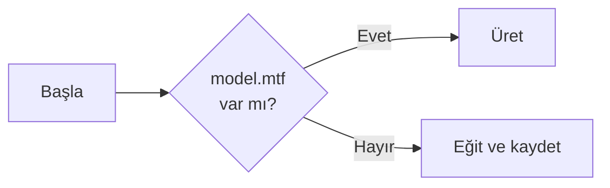

# Komut Satırı

Projenin dört komutu var. Hepsi [Program.cs](../referans/kod-haritasi.md) içindeki `Main` metodunda karşılanır.

## Komutlar

| Komut | Görev | Süre |
|---|---|---|
| `train [dosya]` | Modeli eğitir ve kaydeder | ~2,5 dk |
| `generate [dosya] [prompt]` | Kayıtlı modelden metin üretir | ~4 sn |
| `loss [csv]` | Kaydedilmiş loss eğrisini çizer | anında |
| *(argümansız)* | Model varsa üretir, yoksa eğitir | değişken |

!!! note "`--` işareti neden var?"
    `dotnet run` kendi argümanlarını alır. `--` işaretinden sonrakiler **programa** iletilir. Yani `dotnet run -c Release -- train` demek "Release modunda çalıştır, programa `train` argümanını ver" demektir.

---

## `train` — Eğitim

```powershell
dotnet run -c Release -- train
```

Varsayılan olarak `model.mtf` dosyasına kaydeder. Farklı bir dosya adı verebilirsiniz:

```powershell
dotnet run -c Release -- train deneme1.mtf
dotnet run -c Release -- train model.txt      # metin formatı
```

Uzantı `.txt` ise okunabilir metin formatı, değilse ikili format kullanılır. Ayrıntılar: [Checkpoint](../kullanim/checkpoint.md).

Eğitim sırasında üretilen dosyalar:

- `model.mtf` (veya verdiğiniz ad) — ağırlıklar
- `loss.csv` — adım adım loss ve learning rate

---

## `generate` — Metin üretimi

```powershell
# Varsayılan model, varsayılan başlangıç metni
dotnet run -c Release -- generate

# Kendi başlangıç metninizle
dotnet run -c Release -- generate "bmw 320i 2020 "

# Belirli bir checkpoint dosyasından
dotnet run -c Release -- generate deneme1.mtf "volvo xc60 "
```

Komut şu mantıkla çalışır: ilk argüman **var olan bir dosya** ise checkpoint yolu sayılır, kalanı başlangıç metni olur.

### Başlangıç metni (prompt) neden önemli?

Model bir sonraki karakteri tahmin ederken **son 64 karaktere** bakar. Verdiğiniz metin onun başlangıç bağlamıdır.

```powershell
dotnet run -c Release -- generate "togg "
```

"togg" verdiğinizde model büyük olasılıkla `t10x` veya `t10f` ile devam eder, çünkü veride hep öyle görmüştür. `"mercedes "` verirseniz `c200`, `e200`, `gla` gibi devamlar gelir.

!!! tip "Deneyin"
    Sözlükte olmayan bir karakter verirseniz (örneğin `@`) tokenizer onu sessizce atar. Bu yüzden `"fiat@egea"` ile `"fiategea"` aynı sonucu verir.

---

## `loss` — Eğitim eğrisini görmek

```powershell
dotnet run -c Release -- loss
dotnet run -c Release -- loss eski-deney.csv
```

Eğitim yapmadan, kaydedilmiş `loss.csv` dosyasını okuyup ASCII grafiğe çevirir. Farklı deneyleri karşılaştırmak için idealdir:

```powershell
dotnet run -c Release -- train                  # deney 1
Copy-Item loss.csv deney1.csv
# ... ayarları değiştir, yeniden derle ...
dotnet run -c Release -- train                  # deney 2
dotnet run -c Release -- loss deney1.csv        # eskisini gör
dotnet run -c Release -- loss                   # yenisini gör
```

---

## Argümansız kullanım

```powershell
dotnet run -c Release
```

Akıllı davranır:



İlk çalıştırmada eğitir, sonrakilerde anında üretir.

---

## Ayarları değiştirmek

Şu an tüm hiperparametreler [Program.cs](../referans/kod-haritasi.md) dosyasının başındaki sabitlerde:

```csharp
private const int BlockSize = 64;        // bağlam penceresi
private const int EmbedSize = 96;        // vektör boyutu
private const int Heads = 4;             // attention kafası
private const int Layers = 3;            // blok sayısı
private const int BatchSize = 8;         // adım başına örnek
private const int TrainingSteps = 1500;  // toplam adım
private const double LearningRate = 3e-3;
```

Değiştirdikten sonra yeniden derlemeniz gerekir:

```powershell
dotnet build -c Release
dotnet run -c Release --no-build -- train
```

Hangi ayarın ne işe yaradığı ve ne denemeniz gerektiği: [Deneyler](../ileri/deneyler.md).

!!! danger "Dikkat"
    `EmbedSize` değerinin `Heads` değerine **tam bölünmesi** gerekir. 96 / 4 = 24 ✓. Örneğin `EmbedSize = 100, Heads = 3` yaparsanız model sessizce yanlış çalışır.

---

## Hata mesajları

| Mesaj | Sebep | Çözüm |
|---|---|---|
| `Kayıtlı model yok: ...` | Henüz eğitim yapılmamış | Önce `train` çalıştırın |
| `Loss kaydı yok: ...` | `loss.csv` silinmiş | Önce `train` çalıştırın |
| `Training corpus not found` | `data/input.txt` eksik | Dosyayı geri koyun, yeniden derleyin |
| `Parametre sayısı uyuşmuyor` | Checkpoint farklı bir mimariyle kaydedilmiş | Ayarları eski haline getirin ya da yeniden eğitin |
| `Tensör boyutu uyuşmuyor` | `EmbedSize`/`Layers` değişmiş | Yeniden eğitin |
