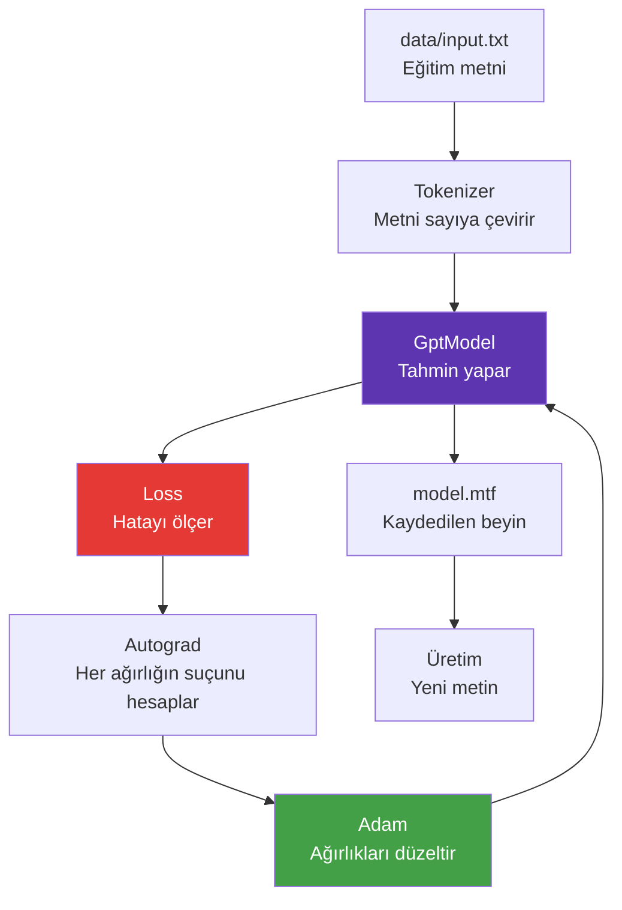

# Bu Proje Nedir?

## Bir cümleyle

Bilgisayara bir metin verip **"bundan sonra ne gelir?"** sorusunu milyonlarca kez sordurarak, o metnin dilini öğrenmesini sağlayan bir program.

## Biraz daha uzun

Diyelim ki elinizde bir araç ilanları listesi var:

```text
renault clio 2021 benzin otomatik hatchback 100hp 780bin tl
fiat egea 2021 dizel manuel sedan 95hp 810bin tl
toyota corolla 2021 hibrit otomatik sedan 122hp 1280bin tl
```

Bir insan bu listeye baktığında şunu fark eder: her satır **marka → model → yıl → yakıt → vites → kasa → güç → fiyat** sırasını izliyor. Ayrıca "dizel"den sonra genelde "manuel" veya "otomatik" gelir, sayılardan sonra "hp" veya "bin tl" gelir.

MiniTransformer de tam olarak bunu öğrenir. Ama kimse ona "marka ilk gelir" demez. Kurallar **hiçbir yere yazılmaz**. Model sadece milyonlarca tahmin yapar, yanılır, düzeltir ve sonunda deseni kendisi keşfeder.

---

## Nasıl öğreniyor? (Sezgisel anlatım)

Şöyle düşünün: Hiç Türkçe bilmeyen birine, sadece Türkçe metinler gösteriyorsunuz. Her seferinde bir harfi kapatıp "bu hangi harf?" diye soruyorsunuz.

```text
renault clio 2021 benz??
                       ↑
                   ne gelir?
```

Başlangıçta rastgele tahmin eder. Yanlış derseniz biraz daha dikkatli bakar. Bunu **on iki bin kez** tekrar ettiğinizde, artık "benz" gördüğünde "in" geleceğini bilir. Çünkü metinde hep öyle olmuştur.

İşte eğitim budur. Modelin "beyni" 350.927 adet sayıdan ibarettir ve her yanlış tahminden sonra bu sayılar **birazcık** değişir. Doğru yöne doğru.

!!! tip "Anahtar fikir"
    Model hiçbir kural ezberlemez. Sadece sayıları ayarlar. Kurallar o sayıların içinde **kendiliğinden** oluşur.

---

## Ne yapabilir, ne yapamaz?

<div class="grid" markdown>

!!! success "Yapabilir"
    - Verideki formatı öğrenip yeni örnekler üretmek
    - Hiç görmediği kelime kombinasyonları uydurmak
    - Türkçe karakterleri, noktalama ve satır yapısını taklit etmek
    - 64 karakterlik geçmişe bakarak tutarlı devam etmek

!!! failure "Yapamaz"
    - Soru cevaplamak (sohbet için eğitilmedi)
    - Matematik yapmak (fiyatlar rastgele uydurulur)
    - 64 karakterden uzak geçmişi hatırlamak
    - Verisinde olmayan bir konuda konuşmak

</div>

Bu sınırlar **kusur değil**, ölçeğin doğal sonucudur. ChatGPT'nin farkı mimari değil, 3 milyon kat daha fazla parametre ve milyar kat daha fazla veridir.

---

## Projenin parçaları



Her kutunun hangi dosyada olduğunu [Kod Haritası](../referans/kod-haritasi.md) sayfasında bulabilirsiniz.

---

## Neden C#?

Çoğu yapay zeka örneği Python ile yazılır. Bu proje bilinçli olarak C# kullanıyor:

- **Derlenen dil**: Döngüler hızlı çalışır, saf Python'da bu proje saatler sürerdi
- **Statik tip**: `float[]` ile `int[]` karışmaz, hatalar derleme anında yakalanır
- **Kütüphane yok**: NumPy'ın gizlediği her şeyi kendimiz yazmak zorunda kaldık — öğrenmek için ideal
- **Tek komut**: Sanal ortam, paket çakışması, CUDA sürümü derdi yok

Sonuçta [Ops.cs](../referans/kod-haritasi.md) içinde gördüğünüz `MatMul`, NumPy'ın `@` operatörünün ta kendisidir — sadece açık haliyle.

---

Sıradaki adım: [Kurulum](kurulum.md)
