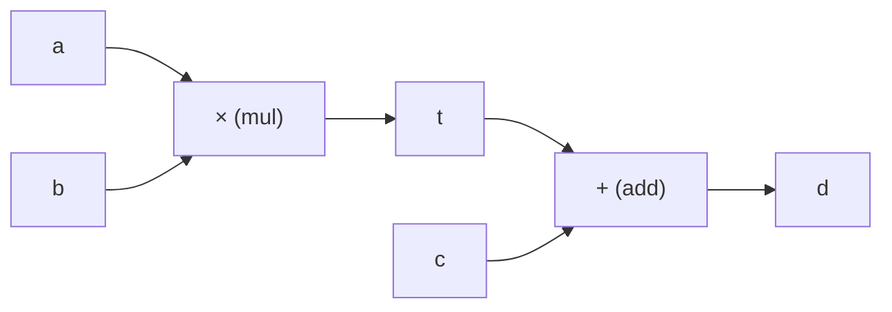

# Autograd (Otomatik Türev)

**Dosya:** `src/Tensor.cs`, `src/Ops.cs`

PyTorch'ta `loss.backward()` yazarsınız ve sihirli şekilde tüm gradyanlar hesaplanır. Bu sayfa o sihrin nasıl çalıştığını anlatıyor — çünkü bu projede onu kendimiz yazdık.

---

## Problem

350.927 ağırlığın her biri için şunu bilmemiz gerekiyor:

$$\frac{\partial L}{\partial w_i}$$

*"Bu ağırlığı birazcık değiştirirsem loss ne kadar değişir?"*

Elle türev almak imkânsız. Sayısal türev (her ağırlığı tek tek oynatıp farkı ölçmek) 350.927 ileri geçiş gerektirir — saatler sürerdi.

**Çözüm:** İleri geçiş sırasında yapılan işlemleri kaydet, sonra zincir kuralını tersten uygula. Tek bir geri geçişte tüm gradyanlar çıkar.

---

## Hesap grafiği

Her işlem, sonucu ve girdilerini bağlayan bir düğüm oluşturur.

`d = (a × b) + c` için:



İleri geçişte soldan sağa değerler hesaplanır. Geri geçişte sağdan sola gradyanlar taşınır.

---

## Tensor: grafiğin düğümü

```csharp
public sealed class Tensor
{
    public readonly float[] Data;    // değerler
    public readonly float[] Grad;    // gradyanlar

    internal Tensor[] Parents = [];  // (1)!
    internal Action? BackwardFn;     // (2)!
}
```

1. Bu tensörün hangi tensörlerden üretildiği
2. Gradyanı ebeveynlere nasıl dağıtacağını bilen kapanış (closure)

Her tensör hem **verisini** hem **gradyanını** hem de **nereden geldiğini** taşır.

---

## Bir işlem nasıl yazılır?

`Add` örneği — en basit olanı:

```csharp
public static Tensor Add(Tensor a, Tensor b)
{
    // 1. Sonuç tensörü, ebeveynleri kaydedilerek oluşturulur
    var outTensor = new Tensor(a.Rows, a.Cols) { Parents = [a, b] };

    // 2. İleri geçiş: değerleri hesapla
    for (int i = 0; i < outTensor.Length; i++)
        outTensor.Data[i] = a.Data[i] + b.Data[i];

    // 3. Geri geçiş: kapanış olarak sakla, ŞİMDİ çalıştırma
    outTensor.BackwardFn = () =>
    {
        for (int i = 0; i < outTensor.Length; i++)
        {
            a.Grad[i] += outTensor.Grad[i];
            b.Grad[i] += outTensor.Grad[i];
        }
    };

    return outTensor;
}
```

Toplamanın türevi 1 olduğu için gradyan olduğu gibi her iki kola kopyalanır.

!!! warning "`+=` neden şart?"
    Bir tensör birden fazla yerde kullanılabilir. Örneğin residual bağlantıda `x` hem attention'a girer hem toplamaya. Gradyanlar **toplanmalıdır**, üzerine yazılmamalıdır.

    `=` kullanmak, bu projedeki en sinsi hata türü olurdu: kod çalışır, loss düşer ama model doğru öğrenmez.

---

## Matris çarpımının türevi

$C = A \times B$ için:

$$\frac{\partial L}{\partial A} = \frac{\partial L}{\partial C} B^{T}, \qquad \frac{\partial L}{\partial B} = A^{T} \frac{\partial L}{\partial C}$$

Kodda:

```csharp
// dA = dC * B^T : i satırları birbirinden bağımsız
void GradARow(int i)
{
    int oRow = i * n, aRow = i * k;
    for (int p = 0; p < k; p++)
        a.Grad[aRow + p] += Dot(og, oRow, bd, p * n, n);
}

// dB = A^T * dC : p satırları birbirinden bağımsız
void GradBRow(int p)
{
    int bRow = p * n;
    for (int i = 0; i < m; i++)
    {
        float av = ad[i * k + p];
        if (av != 0f)
            Axpy(b.Grad, bRow, og, i * n, av, n);
    }
}
```

!!! success "Neden iki ayrı döngü?"
    Tek döngüde yapılabilirdi ama o zaman `b.Grad` farklı iş parçacıkları tarafından aynı anda yazılırdı — **veri yarışı**. İki ayrı döngüde her iş parçacığı kendi satırına yazar, kilit gerekmez. Ayrıntı: [Performans](../ileri/performans.md).

---

## Topolojik sıralama

Gradyanları doğru sırada yaymak için grafiği sıralamamız gerekir: bir düğümün gradyanı hesaplanmadan önce **onu kullanan tüm düğümler** işlenmiş olmalı.

```csharp
private static List<Tensor> TopoOrder(Tensor root)
{
    var order = new List<Tensor>();
    var visited = new HashSet<Tensor>(ReferenceEqualityComparer.Instance);   // (1)!
    var stack = new Stack<(Tensor Node, int Index)>();                       // (2)!

    stack.Push((root, 0));
    visited.Add(root);

    while (stack.Count > 0)
    {
        var (node, index) = stack.Pop();
        if (index < node.Parents.Length)
        {
            stack.Push((node, index + 1));        // (3)!
            var parent = node.Parents[index];
            if (visited.Add(parent))
                stack.Push((parent, 0));
        }
        else
        {
            order.Add(node);                      // (4)!
        }
    }

    return order;
}
```

1. **Referans eşitliği** kullanılır. `Equals` ile karşılaştırılsaydı aynı değerlere sahip farklı tensörler karışabilirdi.
2. **Yinelemeli (iterative) DFS** — özyineleme yerine açık yığın. Grafik yüzlerce düğüm derinliğinde olduğu için yığın taşması riskini ortadan kaldırır.
3. Düğümün kaldığı yerden devam edebilmesi için kendisi tekrar yığına konur.
4. Tüm ebeveynleri işlendikten sonra listeye eklenir → **post-order**.

Sonuç: ebeveynler çocuklardan **önce** listede. Geri geçiş için ters çevirmek yeterli.

---

## Backward: tetikleyici

```csharp
public void Backward()
{
    Grad[0] = 1.0f;                    // (1)!
    var order = TopoOrder(this);
    for (int i = order.Count - 1; i >= 0; i--)
        order[i].BackwardFn?.Invoke();  // (2)!
}
```

1. $\frac{\partial L}{\partial L} = 1$ — zincirin başlangıcı
2. Ters sırada her düğümün kapanışı çalıştırılır

Bu kadar. On beş satırlık kod, 350.927 gradyanın tamamını doğru hesaplıyor.

---

## Somut örnek: adım adım

`L = (a × b) + c` için, `a=2, b=3, c=4`:

### İleri geçiş

```text
t = a × b = 6
L = t + c = 10
```

### Topolojik sıra

```text
[a, b, t, c, L]
```

### Geri geçiş (ters sırada)

| Adım | Düğüm | İşlem | Sonuç |
|---|---|---|---|
| 0 | L | tohum | `L.grad = 1` |
| 1 | L (add) | gradyanı kopyala | `t.grad = 1`, `c.grad = 1` |
| 2 | c | yaprak, işlem yok | — |
| 3 | t (mul) | çapraz çarpım | `a.grad = 1×b = 3`, `b.grad = 1×a = 2` |
| 4 | b, a | yaprak | — |

Doğrulama: $L = ab + c$, $\frac{\partial L}{\partial a} = b = 3$ ✓

---

## Gradyan birikimi ve sıfırlama

Gradyanlar `+=` ile biriktiği için **her adımın başında temizlenmelidir**:

```csharp
// src/AdamOptimizer.cs
public void ZeroGrad()
{
    foreach (var p in _parameters)
        p.ZeroGrad();
}
```

```csharp
// Program.cs — eğitim döngüsü
optimizer.ZeroGrad();     // (1)!
var loss = model.Loss(inputs, targets);
loss.Backward();
optimizer.Step();
```

1. Bu satır unutulursa gradyanlar adımlar arasında birikir ve eğitim çöker. PyTorch'ta da aynı tuzak vardır (`optimizer.zero_grad()`).

!!! note "Ara tensörler neden sıfırlanmıyor?"
    Her ileri geçişte yeni `Tensor` nesneleri oluşturulur, `Grad` dizileri zaten sıfırdır. Sadece **kalıcı** olan parametrelerin temizlenmesi gerekir.

---

## Bellek maliyeti

Geri geçiş için ileri geçişteki **tüm ara değerler** saklanmalıdır. Bir adımda:

- ~30 işlem × 3 blok = ~90 tensör
- Her biri ortalama `[512 × 96]` = 49.152 float
- Toplam ≈ 4,4 milyon float = **~35 MB** (data + grad)

Bu yüzden batch büyüdükçe bellek doğrusal artar. Büyük modellerde **gradient checkpointing** tekniği kullanılır: ara değerler saklanmaz, geri geçişte yeniden hesaplanır. Bellekten tasarruf, hesaptan kayıp.

---

## Neden bu kadar zarif?

Klasik yaklaşımda her katman için türev formülünü elle yazar ve katmanları sabit bir sırada çağırırsınız. Autograd'da ise:

- Her işlem **kendi türevini** bilir
- Grafik **çalışma zamanında** kurulur (dinamik)
- İstediğiniz gibi işlem birleştirebilirsiniz, türev otomatik gelir
- Yeni bir işlem eklemek için sadece ileri + geri formülünü yazmanız yeterli

Bu tasarım PyTorch'un "define-by-run" felsefesinin ta kendisidir ve TensorFlow 1.x'in statik grafiklerine üstünlük sağlamasının sebebidir.

---

Sıradaki adım: [Optimizer](optimizer.md)
