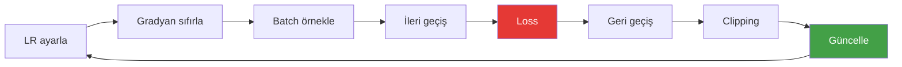

# Eğitim Döngüsü

**Dosya:** `Program.cs` — `Train` metodu

Tüm parçalar hazır. Şimdi onları döndüren motoru inceleyelim.

---

## Döngünün özü

```csharp
for (int step = 1; step <= TrainingSteps; step++)
{
    optimizer.LearningRate = CosineSchedule(step);   // 1. LR'yi ayarla
    optimizer.ZeroGrad();                            // 2. Gradyanları temizle

    var (inputs, targets) = SampleBatch(data, rng);  // 3. Rastgele batch al
    var loss = model.Loss(inputs, targets);          // 4. İleri geçiş + loss
    loss.Backward();                                 // 5. Geri geçiş

    optimizer.ClipGradients(1.0);                    // 6. Gradyanları sınırla
    optimizer.Step();                                // 7. Ağırlıkları güncelle

    lossHistory.Add(loss.Data[0]);
    lrHistory.Add(optimizer.LearningRate);
}
```

Yedi satır. Tüm derin öğrenme bundan ibarettir.



---

## Batch örnekleme

```csharp
private static (int[][] Inputs, int[][] Targets) SampleBatch(int[] data, Random rng)
{
    var inputs = new int[BatchSize][];
    var targets = new int[BatchSize][];

    for (int b = 0; b < BatchSize; b++)
    {
        int start = rng.Next(data.Length - BlockSize - 1);   // (1)!
        inputs[b] = new int[BlockSize];
        targets[b] = new int[BlockSize];
        Array.Copy(data, start, inputs[b], 0, BlockSize);
        Array.Copy(data, start + 1, targets[b], 0, BlockSize);   // (2)!
    }

    return (inputs, targets);
}
```

1. Rastgele bir başlangıç noktası. `- BlockSize - 1` taşmayı engeller.
2. Hedef, girdinin **bir karakter kaydırılmış** hali.

### Görsel örnek

```text
Veri:    ... r e n a u l t   c l i o   2 0 2 1 ...
                ↑_______________________↑
                start                start+64

inputs:  "renault clio 202"
targets: "enault clio 2021"
```

!!! info "Neden rastgele başlangıç?"
    Veriyi baştan sona sırayla okusaydık, model her epoch'ta aynı sırayı görür ve sıraya özgü desenler ezberlerdi. Rastgele örnekleme bunu engeller ve her batch'i bağımsız kılar.

### Verimlilik: 64 örnek bir arada

Tek bir 64 karakterlik dizi, aslında **64 ayrı tahmin görevi** içerir:

| Pozisyon | Görülen bağlam | Tahmin edilecek |
|---|---|---|
| 0 | `r` | `e` |
| 1 | `re` | `n` |
| 2 | `ren` | `a` |
| ... | ... | ... |
| 63 | `renault clio 202` | `1` |

Nedensel maske sayesinde bunların hepsi **tek ileri geçişte** hesaplanır. Batch 8 × 64 pozisyon = adım başına **512 eğitim örneği**.

Bu, transformer'ın RNN'lere göre en büyük avantajıdır. RNN'de her pozisyon sırayla hesaplanmak zorundaydı.

---

## Adım başına ne oluyor?

Tek bir adımın maliyeti:

| İşlem | Miktar |
|---|---|
| Matris çarpımı | ~200 adet |
| Kayan nokta işlemi | ~150 milyon |
| Oluşturulan tensör | ~500 |
| Bellek kullanımı | ~35 MB (sonra GC toplar) |
| Süre (14 çekirdek) | ~91 ms |

1500 adım × 91 ms ≈ 137 saniye.

---

## Epoch kavramı

**Epoch** = veri setinin tamamının bir kez görülmesi.

```text
Veri: 10.128 karakter
Adım başına: 8 × 64 = 512 karakter
Bir epoch: 10.128 / 512 ≈ 20 adım
1500 adım ≈ 76 epoch
```

Model veriyi 76 kez baştan sona görüyor. Bu **çok fazladır** ve ezberleme (overfitting) riski yüksektir.

!!! warning "Gerçek projelerde"
    Büyük dil modelleri veriyi genelde **1-2 epoch** görür. Çünkü veri o kadar büyüktür ki tekrar etmeye gerek kalmaz. Bizim 10 KB'lık verimizde tekrar kaçınılmaz.

---

## Loss neden zıplıyor?

```text
step 150: 1.3983
step 200: 1.4573   ← yükseldi!
step 250: 1.1089
```

Üç sebep:

1. **Rastgele batch**: Bazı metin parçaları doğası gereği daha zor (örneğin açıklama cümleleri, araç kayıtlarından daha az düzenli)
2. **Küçük batch**: 8 örnek, gerçek gradyanın gürültülü bir tahminidir
3. **Yüksek LR**: Büyük adımlar minimumun etrafında salınıma yol açar

Endişelenmeniz gereken durum: loss'un **genel eğiliminin** yükselmesi veya `NaN` olması.

| Belirti | Sebep | Çözüm |
|---|---|---|
| Loss `NaN` | Gradyan patlaması | LR'yi düşürün, clipping'i kontrol edin |
| Loss sabit kalıyor | LR çok küçük | LR'yi artırın |
| Loss çok yavaş düşüyor | Model küçük veya LR düşük | `EmbedSize`/`Layers` artırın |
| Loss dalgalanıyor ama düşüyor | Normal | Bir şey yapmayın |

---

## İzleme ve kayıt

```csharp
if (step % 50 == 0 || step == 1)
{
    Console.WriteLine($"step {step,5}/{TrainingSteps}  loss {loss.Data[0]:F4}  " +
                      $"lr {optimizer.LearningRate:E2}  {stopwatch.Elapsed.TotalSeconds:F1}s");
}
```

Her 50 adımda bir rapor. Her adımda yazmak konsolu boğar ve I/O yüzünden eğitimi yavaşlatır.

Tüm değerler ayrıca hafızada tutulup sonda CSV'ye yazılır:

```csharp
private static string SaveLossCsv(List<double> losses, List<double> learningRates)
{
    string path = Path.Combine(Directory.GetCurrentDirectory(), "loss.csv");
    var sb = new StringBuilder("step,loss,lr\n");
    for (int i = 0; i < losses.Count; i++)
        sb.Append(CultureInfo.InvariantCulture, $"{i + 1},{losses[i]:F6},{learningRates[i]:G6}\n");

    File.WriteAllText(path, sb.ToString());
    return path;
}
```

!!! note "`InvariantCulture` neden şart?"
    Türkçe yerelde ondalık ayırıcı virgüldür. `0,26` yazılsaydı CSV sütunları bozulurdu. `InvariantCulture` her zaman nokta kullanır.

---

## Determinizm

```csharp
var rng = new Random(1337);
```

Sabit tohum sayesinde:

- Ağırlık ilklemesi her seferinde aynı
- Batch seçimi her seferinde aynı
- Paralel matris çarpımı da deterministik (her iş parçacığı kendi satırına yazar, toplama sırası sabit)

Sonuç: **aynı kod = aynı loss eğrisi**. Deney yaparken bu çok değerlidir; bir değişikliğin etkisini net görürsünüz.

Üretim aşamasında ise `new Random()` kullanılır — her çalıştırmada farklı metin gelsin diye.

---

## Eğitim sonrası

```csharp
Console.Write(LossChart.Render(lossHistory));
PrintLossSummary(lossHistory);
Console.WriteLine($"csv : {SaveLossCsv(lossHistory, lrHistory)}");

Checkpoint.Save(checkpointPath, model, tokenizer);
Console.WriteLine($"model: {checkpointPath} ({new FileInfo(checkpointPath).Length / 1024.0:F0} KB)");

Console.WriteLine(model.Generate(tokenizer, DefaultPrompt, maxNewTokens: 400,
                                 temperature: 0.8, topK: 10, rng));
```

Dört çıktı: eğrinin grafiği, özet istatistikler, CSV dosyası, checkpoint dosyası ve bir örnek üretim.

---

## Eksik olanlar (bilinçli sadeleştirmeler)

Gerçek bir eğitim betiğinde olup burada olmayanlar:

| Özellik | Ne işe yarar | Neden yok |
|---|---|---|
| **Doğrulama seti** | Ezberlemeyi tespit eder | Basitlik |
| **Early stopping** | Doğrulama kötüleşince durur | Doğrulama yok |
| **Ara checkpoint** | Çökmeye karşı koruma | Eğitim sadece 2 dakika |
| **Weight decay** | Düzenlileştirme | Küçük modelde etkisi az |
| **Dropout** | Düzenlileştirme | Küçük modelde gereksiz |
| **Öğrenme oranı arama** | Optimal LR bulma | Elle ayarlandı |
| **Mixed precision** | GPU'da hız | GPU yok |

Bunları eklemek harika alıştırmalardır — bkz. [Deneyler](../ileri/deneyler.md).

---

Sıradaki adım: [Metin Üretimi](../kullanim/uretim.md)
