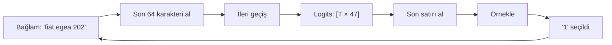

# Metin Üretimi

**Dosya:** `src/GptModel.cs` — `Generate`, `SampleLastRow`

Eğitim bitti, model hazır. Şimdi ondan metin alacağız.

---

## Üretim döngüsü

```csharp
for (int step = 0; step < maxNewTokens; step++)
{
    var window = context.Skip(Math.Max(0, context.Count - _config.BlockSize)).ToArray();
    var logits = Forward([window]);
    int next = SampleLastRow(logits, temperature, topK, rng);
    context.Add(next);
    generated.Add(next);
}
```



!!! question "Neden sadece son satır?"
    `Forward` tüm pozisyonlar için tahmin üretir. Ama bizim ilgilendiğimiz sadece **en sondaki** — çünkü o, "tüm bağlamdan sonra ne gelir?" sorusunun cevabıdır.

    Diğer satırlar eğitimde kullanılır, üretimde atılır.

---

## Örnekleme: neden en olasıyı seçmiyoruz?

En basit yöntem **greedy** (açgözlü) seçimdir: her zaman en yüksek olasılıklı karakteri al.

Sonuç felakettir:

```text
fiat egea 2021 benzin otomatik sedan 100hp 780bin tl
fiat egea 2021 benzin otomatik sedan 100hp 780bin tl
fiat egea 2021 benzin otomatik sedan 100hp 780bin tl
```

Model **kısır döngüye** girer. Çünkü deterministiktir: aynı bağlam → aynı çıktı → aynı bağlam...

Çözüm: olasılık dağılımından **rastgele örneklemek**.

---

## Temperature (sıcaklık)

```csharp
scores[i] = logits.Data[offset + i] / Math.Max(temperature, 1e-6);
```

Logitler softmax'tan önce sıcaklığa bölünür.

$$p_i = \frac{e^{x_i / T}}{\sum_j e^{x_j / T}}$$

### Etkisi

Ham logitler `[3.0, 1.0, 0.5]` olsun:

| T | Olasılıklar | Davranış |
|---|---|---|
| 0.1 | 0.9999, 0.0000, 0.0000 | Neredeyse greedy, çok tekrarcı |
| 0.5 | 0.964, 0.018, 0.007 | Güvenli, tutarlı |
| **0.8** | **0.870, 0.071, 0.038** | **Denge (varsayılan)** |
| 1.0 | 0.786, 0.106, 0.064 | Ham dağılım |
| 1.5 | 0.638, 0.164, 0.117 | Yaratıcı ama hatalı |
| 3.0 | 0.470, 0.242, 0.205 | Neredeyse rastgele, saçma |

!!! tip "Sezgi"
    Sıcaklık, dağılımın "düzlüğünü" ayarlar.

    - **Düşük T** → keskinleştirir → model en emin olduğu şeyi söyler
    - **Yüksek T** → düzleştirir → düşük olasılıklı seçenekler de şans bulur

    Fizikteki Boltzmann dağılımından gelir: düşük sıcaklıkta sistem en düşük enerji durumunda kalır, yüksek sıcaklıkta her duruma zıplar.

### Denemeler

```powershell
# Sıcaklığı değiştirmek için GptModel.Generate çağrısındaki
# temperature: 0.8 değerini düzenleyip yeniden derleyin
```

| T | Tipik çıktı |
|---|---|
| 0.3 | `toyota corolla 2021 benzin otomatik sedan 100hp 1180bin tl` (hep aynı kalıp) |
| 0.8 | `mg 4 2023 elektrik otomatik suv 299hp 1680bin tl` (çeşitli, doğru) |
| 1.5 | `tqyoga cxrxlla 20z1 benzir otxmatik` (bozulmaya başlar) |

---

## Top-k örnekleme

```csharp
if (topK > 0 && topK < vocab)
{
    double threshold = scores.OrderByDescending(s => s).ElementAt(topK - 1);
    for (int i = 0; i < vocab; i++)
        if (scores[i] < threshold)
            scores[i] = double.NegativeInfinity;   // (1)!
}
```

1. Eşiğin altındakiler tamamen elenir; softmax'tan sonra olasılıkları 0 olur.

Sadece en olası **k** karakteri bırakır, gerisini siler.

### Neden gerekli?

47 karakterin 40'ı bağlama tamamen uygunsuz olabilir — ama her birinin %0,1 olasılığı vardır. Toplamda **%4 ihtimalle saçma bir karakter** gelir. 400 karakterlik üretimde bu 16 hata demektir.

Top-k bu kuyruğu keser.

| k | Etki |
|---|---|
| 1 | Greedy'ye eşdeğer, kısır döngü |
| 5 | Çok güvenli, az çeşitlilik |
| **10** | **Denge (varsayılan)** |
| 40 | Neredeyse filtresiz |
| 0 | Filtre yok |

---

## Diğer stratejiler

| Yöntem | Nasıl çalışır | Durum |
|---|---|---|
| **Greedy** | En olasıyı al | Kısır döngü riski |
| **Top-k** (bu proje) | İlk k'yı bırak | Basit, etkili |
| **Top-p / nucleus** | Kümülatif olasılık p'ye ulaşana kadar al | Modern standart, adaptif |
| **Beam search** | Birden çok yolu paralel takip et | Çeviride iyi, sohbette kötü |
| **Repetition penalty** | Tekrarlanan tokenleri cezalandır | Kısır döngüyü kırar |

!!! example "Top-p eklemek kolay bir alıştırma"
    Top-k'nın sorunu sabit olmasıdır. Model çok eminse 10 seçenek fazla, kararsızsa 10 seçenek az olabilir.

    Top-p (nucleus) bunu adaptif yapar: olasılıkları büyükten küçüğe sıralar, kümülatif toplam %90'a ulaşana kadar alır. Bazen 2 token, bazen 30 token kalır.

---

## Örnekleme kodu

```csharp
private static int SampleLastRow(Tensor logits, double temperature, int topK, Random rng)
{
    int vocab = logits.Cols;
    int offset = (logits.Rows - 1) * vocab;   // (1)!

    var scores = new double[vocab];
    for (int i = 0; i < vocab; i++)
        scores[i] = logits.Data[offset + i] / Math.Max(temperature, 1e-6);   // (2)!

    // ... top-k filtresi ...

    double max = scores.Max();
    double sum = 0.0;
    for (int i = 0; i < vocab; i++)
    {
        scores[i] = double.IsNegativeInfinity(scores[i]) ? 0.0 : Math.Exp(scores[i] - max);
        sum += scores[i];
    }

    double pick = rng.NextDouble() * sum;    // (3)!
    for (int i = 0; i < vocab; i++)
    {
        pick -= scores[i];
        if (pick <= 0.0)
            return i;
    }

    return vocab - 1;
}
```

1. Son satırın başlangıç indeksi
2. `Math.Max(temperature, 1e-6)` sıfıra bölmeyi engeller
3. **Roulette wheel** örneklemesi: 0 ile toplam arasında rastgele bir nokta seç, ağırlıkları sırayla çıkararak hangi dilime düştüğünü bul

### Roulette wheel görseli

```text
Olasılıklar: [0.5, 0.3, 0.2]
Çizgi:       |--------|-----|---|
             0       0.5   0.8  1.0
                  ↑
             rastgele nokta 0.35 → 0. indeks seçilir
```

---

## Bağlam penceresi kayması

```csharp
var window = context.Skip(Math.Max(0, context.Count - _config.BlockSize)).ToArray();
```

Bağlam 64'ü aştığında **baştan kırpılır**:

```text
Adım 64:  [t0  t1  t2 ... t63]
Adım 65:  [    t1  t2 ... t63 t64]   ← t0 kayboldu
Adım 66:  [        t2 ... t64 t65]
```

Model için `t0` artık hiç var olmamıştır. 400 karakter ürettiğinizde, ilk verdiğiniz prompt çoktan unutulmuştur.

!!! info "KV cache neden yok?"
    Her adımda 64 karakterin tamamı yeniden hesaplanıyor. Oysa `t1...t63` için hesaplanan Key ve Value vektörleri bir önceki adımdan aynen geçerli.

    Gerçek sistemler bunları önbellekte tutar ve sadece yeni tokeni hesaplar — 10-50 kat hızlanma sağlar. Bu projede eklenmedi çünkü kodu ciddi şekilde karmaşıklaştırırdı ve 400 token zaten 4 saniyede üretiliyor.

---

## Çıktıyı yorumlamak

```text
toyota corolla 2021 hibrit otomatik hatchback 120hp 10240bin tl
kia sedan 2021 dizel otomatik suv 180hp 1750bin tl
hyundai itonic 2022 benzin otomatik hatchback 100hp 780bin tl
```

| Gözlem | Ne anlama geliyor |
|---|---|
| Format kusursuz | Model yapıyı öğrendi |
| Gerçek marka isimleri | Karakter dizilimlerini ezberledi |
| `kia sedan` | Kelimelerin **rolünü** değil **pozisyonunu** öğrendi |
| `10240bin tl` | Sayı kavramı yok, sadece rakam deseni var |
| `hyundai itonic` | **Genelleme yapıyor** — veride yok, uydurdu |

Son madde en önemlisidir. Model kopyalamıyor, öğrendiği desenden yeni örnekler türetiyor.

---

## Prompt mühendisliği (mini sürüm)

Verdiğiniz başlangıç metni, modelin bağlamıdır:

```powershell
dotnet run -c Release -- generate "togg "
# → t10x veya t10f ile devam eder

dotnet run -c Release -- generate "elektrikli "
# → açıklama cümlesi tarzında devam eder

dotnet run -c Release -- generate "bmw x"
# → 1 veya 3 gelir, çünkü veride bmw x1 ve bmw x3 var
```

Model prompt'a "uyum sağlamaz" — sadece onu bağlam olarak alıp istatistiksel devamı üretir. Büyük modellerdeki "talimat takip etme" yeteneği ayrı bir eğitim aşamasının (instruction tuning) ürünüdür.

---

Sıradaki adım: [Checkpoint](checkpoint.md)
