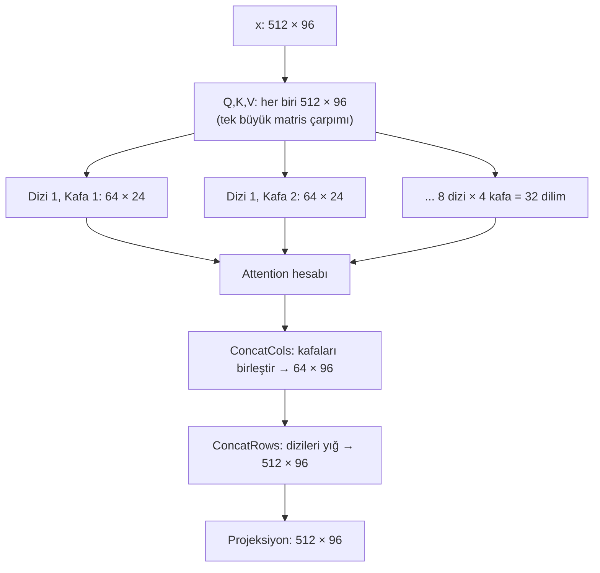

# Attention

**Dosya:** `src/Layers.cs` — `MultiHeadSelfAttention` sınıfı

Bu, projenin ve tüm modern yapay zekanın kalbidir. 2017'de yayımlanan *"Attention Is All You Need"* makalesi bu mekanizmayı tanıttı ve her şeyi değiştirdi.

---

## Problem: bağlam olmadan anlam olmaz

Bir karakterin ne olduğunu bilmek yetmez, **çevresinde ne olduğunu** bilmek gerekir.

```text
"... 2021 benzin oto|"     → 'm' gelmeli (otomatik)
"... turbo moto|"          → 'r' gelmeli (motor)
```

Her iki durumda da son karakterler `oto`/`oto` benzer ama devamı farklı. Model doğru tahmin için **geriye bakmalı**.

Attention tam olarak bunu yapar: her karakterin, kendinden önceki karakterlerden ihtiyacı olan bilgiyi çekmesini sağlar.

---

## Üç rol: Query, Key, Value

Attention'ı bir **kütüphane araması** gibi düşünün:

| Rol | Kütüphane benzetmesi | Matematiksel karşılığı |
|---|---|---|
| **Query (Q)** | Aradığınız konu: "Türkçe dilbilgisi" | Bu tokenin sorusu |
| **Key (K)** | Kitapların sırt etiketleri | Her tokenin "ben şuyum" etiketi |
| **Value (V)** | Kitabın içindeki bilgi | Eşleşme olursa alınacak içerik |

Üçü de aynı girdiden, **farklı ağırlıklarla** üretilir:

```csharp
var q = _query.Forward(x);   // [512 × 96]
var k = _key.Forward(x);     // [512 × 96]
var v = _value.Forward(x);   // [512 × 96]
```

!!! info "Self-attention ne demek?"
    Q, K ve V hepsi **aynı** dizidan üretiliyor. Yani dizi kendi kendine bakıyor. Buna *self-attention* denir. (Çeviri modellerinde Q bir dilden, K/V diğerinden gelir; buna *cross-attention* denir.)

---

## Formül

$$\text{Attention}(Q,K,V) = \text{softmax}\!\left(\frac{QK^{T}}{\sqrt{d_k}}\right)V$$

Beş adımda inceleyelim.

### Adım 1: Skorlar — $QK^T$

```csharp
var scores = Ops.MatMul(qh, Ops.Transpose(kh));   // [64 × 64]
```

$[64 \times 24] \times [24 \times 64] = [64 \times 64]$

Bu matrisin $(i,j)$ elemanı: *"i. karakterin sorusu, j. karakterin etiketiyle ne kadar uyuşuyor?"*

Nokta çarpımı benzerlik ölçer: iki vektör aynı yöne bakıyorsa büyük, zıt yöne bakıyorsa küçük sonuç verir.

### Adım 2: Ölçekleme — $\div\sqrt{d_k}$

```csharp
float scale = (float)(1.0 / Math.Sqrt(_headSize));   // 1/√24 ≈ 0.204
var scores = Ops.Scale(Ops.MatMul(qh, Ops.Transpose(kh)), scale);
```

Neden gerekli? 24 sayının nokta çarpımı büyük değerler üretir (örneğin 15). Softmax'a 15 gibi bir sayı girerse çıktı neredeyse `[0,0,...,1,...,0]` olur — yani **doyuma girer**. Doymuş softmax'ın türevi sıfıra yakındır, gradyan akmaz, model öğrenemez.

$\sqrt{d_k}$'ye bölmek skorları makul aralıkta tutar.

### Adım 3: Nedensel maske

```csharp
public static Tensor CausalMask(Tensor scores)
{
    outTensor.Data[...] = c <= r ? scores.Data[...] : -1e9f;   // (1)!
}
```

1. Sütun indeksi satır indeksinden büyükse (yani "gelecek"se) skoru eksi sonsuza çeker.

Görsel olarak (✓ = görülebilir, ✗ = engelli):

```text
        t0  t1  t2  t3
  t0 [  ✓   ✗   ✗   ✗  ]
  t1 [  ✓   ✓   ✗   ✗  ]
  t2 [  ✓   ✓   ✓   ✗  ]
  t3 [  ✓   ✓   ✓   ✓  ]
```

!!! danger "Bu maske olmasaydı ne olurdu?"
    Model 5. karakteri tahmin ederken 6. karakteri görebilirdi. Yani cevabı kopyalardı. Eğitim loss'u anında sıfıra düşer ama model hiçbir şey öğrenmemiş olur — üretim sırasında gelecek yoktur ve model tamamen çuvallar.

    Buna **veri sızıntısı** (data leakage) denir ve makine öğrenmesinin en klasik hatasıdır.

Neden `-1e9` da `float.NegativeInfinity` değil? Çünkü $e^{-\infty}$ hesabı `NaN` üretebilir. `-1e9` ise $e^{-10^9} = 0$ verir, güvenlidir.

### Adım 4: Softmax

```csharp
var weights = Ops.SoftmaxRows(Ops.CausalMask(scores));
```

Her satır toplamı 1 olan **dikkat ağırlıkları**na dönüşür:

```text
t3 satırı: [0.05, 0.12, 0.71, 0.12]
           "3. karakter, çoğunlukla 2. karaktere bakıyor"
```

- **Keskin dağılım** (0.98, 0.01, 0.01) → model emin
- **Düz dağılım** (0.25, 0.25, 0.25, 0.25) → model kararsız

### Adım 5: Değerlerin ağırlıklı toplamı

```csharp
headOutputs[h] = Ops.MatMul(weights, vh);   // [64×64] × [64×24] = [64×24]
```

Her karakter, baktığı karakterlerin Value vektörlerinin **ağırlıklı ortalamasını** alır. Bilgi böylece taşınır.

---

## Multi-head: neden birden fazla kafa?

96 boyutu tek bir attention'a vermek yerine, **4 parçaya bölüp** her parçayı ayrı hesaplıyoruz:

```csharp
_headSize = embedSize / heads;   // 96 / 4 = 24

for (int h = 0; h < _heads; h++)
{
    int offset = h * _headSize;
    var qh = Ops.Slice(q, rowStart, seqLen, offset, _headSize);
    ...
}
sequences[b] = Ops.ConcatCols(headOutputs);   // 4 × 24 = 96
```

Her kafa farklı bir ilişki türü öğrenebilir:

| Kafa | Öğrenebileceği desen |
|---|---|
| 1 | Bir önceki karakter (yerel bağlam) |
| 2 | Satır başı nerede (format) |
| 3 | Kelime sınırları (boşluklar) |
| 4 | Uzak bağımlılık (marka → fiyat aralığı) |

!!! tip "Neden bölmek daha iyi?"
    Tek büyük attention, tüm ilişkileri **tek bir** ağırlık dağılımına sıkıştırmak zorunda kalır. 4 kafa, 4 farklı dağılım demektir. Aynı parametre bütçesiyle daha zengin davranış.

---

## Batch'li attention: kritik incelik

Bu projede 8 dizi tek matriste yığılıdır (`[512 × 96]`). Ama attention **dizi sınırlarını geçmemelidir**.

```csharp
for (int b = 0; b < batchCount; b++)
{
    int rowStart = b * seqLen;           // (1)!
    var headOutputs = new Tensor[_heads];

    for (int h = 0; h < _heads; h++)
    {
        int offset = h * _headSize;      // (2)!
        var qh = Ops.Slice(q, rowStart, seqLen, offset, _headSize);
        ...
    }
    sequences[b] = Ops.ConcatCols(headOutputs);
}
return _projection.Forward(Ops.ConcatRows(sequences));
```

1. **Satır dilimlemesi** — hangi dizi
2. **Sütun dilimlemesi** — hangi kafa

Yani `Ops.Slice` iki boyutta birden keser: satırlar diziyi, sütunlar kafayı seçer.



!!! success "Verimlilik dengesi"
    Q, K, V ve son projeksiyon **tek büyük çarpım** olarak yapılır (hızlı). Sadece skor hesabı dizi/kafa bazında ayrılır (zorunlu). Böylece hem doğruluk hem performans sağlanır.

---

## Son projeksiyon neden var?

```csharp
return _projection.Forward(Ops.ConcatRows(sequences));
```

4 kafanın çıktısı basitçe yan yana yapıştırılmıştır. Projeksiyon katmanı bu parçaları **harmanlar** — kafalar arasında bilgi alışverişi sağlar. Olmasaydı kafalar birbirinden tamamen habersiz kalırdı.

---

## Hesaplama maliyeti

| İşlem | Boyut | Çarpma sayısı |
|---|---|---|
| Q, K, V üretimi | 3 × [512×96] × [96×96] | 14,2 milyon |
| Skorlar (32 dilim) | 32 × [64×24] × [24×64] | 3,1 milyon |
| Ağırlıklı toplam | 32 × [64×64] × [64×24] | 3,1 milyon |
| Projeksiyon | [512×96] × [96×96] | 4,7 milyon |

Skor hesabı dizi uzunluğunun **karesiyle** büyür. `BlockSize`'ı 64'ten 128'e çıkarırsanız o kısım 4 katına çıkar. Bu, uzun bağlamın neden pahalı olduğunun cevabıdır.

---

Sıradaki adım: [Transformer Bloğu](blok.md)
