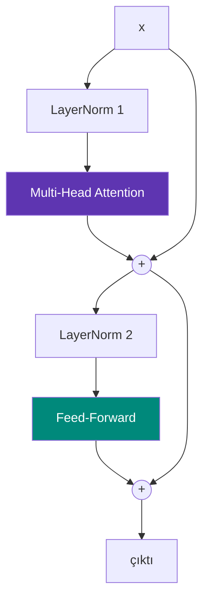

# Transformer Bloğu

**Dosya:** `src/Layers.cs` — `TransformerBlock`, `FeedForward`, `LayerNorm`

Attention tek başına yeterli değil. Onu kullanışlı kılan üç yardımcı daha var: feed-forward, residual bağlantı ve layer norm. Bu dördü birlikte **transformer bloğunu** oluşturur.

---

## Blok tamamı: 4 satır

```csharp
public Tensor Forward(Tensor x, int batchCount, int seqLen)
{
    x = Ops.Add(x, _attention.Forward(_norm1.Forward(x), batchCount, seqLen));
    return Ops.Add(x, _feedForward.Forward(_norm2.Forward(x)));
}
```

Şemaya dökelim:



İki alt katman, her birinin önünde normalizasyon, her birinin etrafında bir kısa devre.

---

## 1. Feed-Forward: modelin düşünme yeri

```csharp
public sealed class FeedForward : IModule
{
    public FeedForward(int embedSize, Random rng)
    {
        _up = new Linear(embedSize, 4 * embedSize, rng);     // 96 → 384
        _down = new Linear(4 * embedSize, embedSize, rng);   // 384 → 96
    }

    public Tensor Forward(Tensor x) => _down.Forward(Ops.Gelu(_up.Forward(x)));
}
```

Üç adım: **genişlet → doğrusallığı kır → daralt**.

### Neden 4 kat genişletme?

Orijinal Transformer makalesinde seçilen oran budur ve o günden beri neredeyse herkes kullanıyor. Mantığı: geniş ara katman, modele karmaşık dönüşümler için "çalışma alanı" verir.

Dar tutarsanız model bilgi sıkıştırmak zorunda kalır ve kapasitesi düşer.

### Attention vs. Feed-Forward

!!! quote "İş bölümü"
    **Attention** = bilgiyi tokenler arasında **taşır** (yatay hareket)
    **Feed-Forward** = her tokenin bilgisini **işler** (dikey hareket)

Feed-forward her satıra **bağımsız** uygulanır. 512. satırın hesabı 511. satırdan etkilenmez. Bu yüzden tek büyük matris çarpımı olarak yapılabilir.

### Parametre payı

| Katman | Boyut | Parametre |
|---|---|---|
| `_up` | 96 × 384 + 384 | 37.248 |
| `_down` | 384 × 96 + 96 | 36.960 |
| Blok başına toplam | | 74.208 |
| 3 blok | | **222.624** (modelin %63'ü) |

Parametrelerin üçte ikisi burada. Modelin "bilgi deposu" feed-forward katmanlarıdır.

---

## 2. Residual bağlantı: `x + f(x)`

```csharp
x = Ops.Add(x, _attention.Forward(...));
```

Alt katmanın çıktısı girdinin **yerine geçmiyor**, girdiye **ekleniyor**. Bu küçük detay derin ağları mümkün kılan şeydir.

### Neden bu kadar önemli?

**Gradyan akışı.** Zincir kuralında türevler çarpılır:

$$\frac{\partial L}{\partial x_1} = \frac{\partial L}{\partial x_n} \cdot \frac{\partial x_n}{\partial x_{n-1}} \cdots \frac{\partial x_2}{\partial x_1}$$

Her terim 0,5 ise ve 20 katman varsa: $0.5^{20} \approx 0.000001$. Gradyan yok olur, alt katmanlar öğrenemez. Buna **vanishing gradient** (kaybolan gradyan) denir.

Residual bağlantı bir **otoyol** açar. `y = x + f(x)` için türev:

$$\frac{\partial y}{\partial x} = 1 + \frac{\partial f}{\partial x}$$

O `1` sayesinde gradyan hiç zayıflamadan geriye ulaşır.

Kodda bunu görebilirsiniz:

```csharp
// src/Ops.cs — Add
outTensor.BackwardFn = () =>
{
    for (int i = 0; i < outTensor.Length; i++)
    {
        a.Grad[i] += outTensor.Grad[i];   // (1)!
        b.Grad[i] += outTensor.Grad[i];
    }
};
```

1. Gradyan **olduğu gibi** her iki kola da kopyalanır. Hiç küçülmez.

!!! info "Tarihsel not"
    Residual bağlantılar 2015'te ResNet ile görüntü işlemede tanıtıldı ve 150+ katmanlı ağları mümkün kıldı. Transformer bu fikri devraldı. Onsuz 3 katman zar zor çalışır, 12 katman imkânsız olurdu.

### İkinci fayda: kolay "hiçbir şey yapmama"

Eğer bir blok işe yaramıyorsa, ağırlıklarını sıfıra yaklaştırarak `f(x) ≈ 0` yapabilir ve `y ≈ x` olur. Yani blok kendini devre dışı bırakabilir. Bu, derin ağların eğitimini çok kolaylaştırır.

---

## 3. LayerNorm: sayıları dengede tutmak

```csharp
public static Tensor LayerNorm(Tensor x, Tensor gain, Tensor bias, float eps = 1e-5f)
```

Her **satırı** (yani her token vektörünü) bağımsız olarak normalize eder:

$$\hat{x} = \frac{x - \mu}{\sqrt{\sigma^2 + \epsilon}}, \qquad y = \gamma \hat{x} + \beta$$

1. Satırın ortalaması ($\mu$) ve varyansı ($\sigma^2$) hesaplanır
2. Ortalama çıkarılır, standart sapmaya bölünür → ortalama 0, varyans 1
3. Öğrenilebilir $\gamma$ (gain) ile çarpılır, $\beta$ (bias) eklenir

### Neden gerekli?

Katmanlar üst üste geldikçe aktivasyon değerleri kayar: kimi katmanda 0.001, kiminde 5000. Bu kaymalar eğitimi kararsızlaştırır ve learning rate seçimini imkânsızlaştırır.

LayerNorm her adımda ölçeği sıfırlar, böylece tüm katmanlar benzer aralıkta çalışır.

### $\epsilon$ neden var?

```csharp
invStd[r] = (float)(1.0 / Math.Sqrt(variance + eps));
```

Bir satırın tüm elemanları eşitse varyans 0 olur ve sıfıra bölme hatası oluşur. `eps = 1e-5` bunu engeller.

### $\gamma$ ve $\beta$ neden var?

Normalizasyon bilgiyi kısıtlar (her vektör aynı ölçeğe zorlanır). $\gamma$ ve $\beta$ modele bu kısıtı gerektiğinde **geri alma** imkânı verir. Başlangıç değerleri $\gamma = 1$, $\beta = 0$ — yani "dokunma".

```csharp
Array.Fill(Gain.Data, 1.0f);
```

---

## Pre-norm vs. Post-norm

İki yerleşim mümkün:

=== "Pre-norm (bu proje)"

    ```csharp
    x = x + Attention(LayerNorm(x));
    ```

    - Normalizasyon alt katmandan **önce**
    - Residual yolu tamamen temiz kalır
    - Isınma (warmup) olmadan da eğitilebilir
    - GPT-2 ve sonrası, Llama, modern modellerin çoğu

=== "Post-norm (orijinal 2017)"

    ```csharp
    x = LayerNorm(x + Attention(x));
    ```

    - Normalizasyon toplama sonrasında
    - Residual yolu her adımda normalizasyondan geçer
    - Derin ağlarda kararsız, dikkatli warmup ister
    - Orijinal Transformer, BERT

Pre-norm'un kazanmasının sebebi: residual otoyolunun hiç kesintiye uğramaması.

---

## LayerNorm'un geri geçişi

Bu projenin en karmaşık türevi budur. Normalizasyon satırdaki **tüm** elemanları birbirine bağladığı için, tek bir elemanın gradyanı diğerlerine de bağımlıdır:

$$\frac{\partial L}{\partial x_i} = \frac{1}{\sigma}\left(d\hat{x}_i - \overline{d\hat{x}} - \hat{x}_i \cdot \overline{d\hat{x} \cdot \hat{x}}\right)$$

```csharp
float mD = (float)(meanDxhat / n);
float mDX = (float)(meanDxhatXhat / n);

for (int c = 0; c < n; c++)
{
    float dxhat = outTensor.Grad[b + c] * gain.Data[c];
    x.Grad[b + c] += invStd[r] * (dxhat - mD - (normalized[b + c] * mDX));
}
```

!!! note "Karma hassasiyet detayı"
    Ortalamalar `double` içinde birikir, sonuç `float`'a çevrilir. Toplama işlemlerinde `float` hassasiyeti yetersiz kalabilir; bu küçük önlem sayısal kararlılığı korur.

---

## Blokları üst üste koymak

```csharp
foreach (var block in _blocks)
    x = block.Forward(x, batch, seqLen);
```

Giriş ve çıkış boyutu aynı olduğu için istediğiniz kadar blok ekleyebilirsiniz. Derinliğin etkisi:

| Katman | Loss (1500 adım) | Süre |
|---|---|---|
| 1 | ~0,75 | ~50 sn |
| 2 | ~0,40 | ~95 sn |
| **3 (varsayılan)** | **~0,26** | **~137 sn** |
| 6 | ~0,18 | ~270 sn |

Azalan verim yasası: her ek katman daha az kazandırır ama süreyi doğrusal artırır.

---

Sıradaki adım: [Model](model.md)
