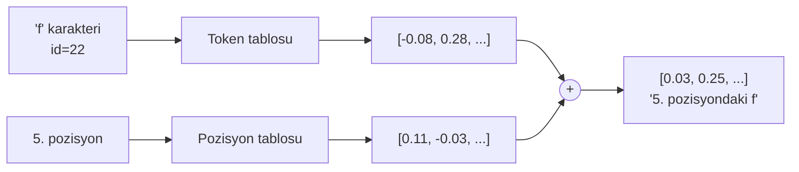

# Embedding

**Dosya:** `src/GptModel.cs` (tablolar), `src/Ops.cs` (`Gather`)

Tokenizer bize sayı verdi: `f` = 22. Ama bu sayı **anlamsızdır**. 22 ile 23 arasında hiçbir ilişki yoktur; sadece alfabetik komşular.

Embedding, bu anlamsız id'yi **anlamlı bir vektöre** çevirir.

---

## Embedding tablosu nedir?

Basitçe bir arama tablosu (lookup table):

```csharp
_tokenEmbedding = new Tensor(config.VocabSize, config.EmbedSize);  // [47 × 96]
```

47 satır (her karakter için bir), 96 sütun (vektör boyutu).

```text
id  0 (\n) → [ 0.012, -0.331,  0.087, ...,  0.201]
id  1 (\r) → [-0.144,  0.092, -0.015, ...,  0.033]
id  2 (' ')→ [ 0.203,  0.118, -0.442, ..., -0.097]
...
id 22 ('f')→ [-0.081,  0.276,  0.194, ...,  0.055]
```

`f` karakterinin "anlamı", 22. satırdaki 96 sayıdır.

!!! question "Bu sayılar nereden geliyor?"
    Başlangıçta **rastgele**:

    ```csharp
    _tokenEmbedding.Data[i] = (float)(Linear.NextGaussian(rng) * 0.02);
    ```

    Eğitim sırasında diğer tüm ağırlıklar gibi güncellenirler. Sonunda benzer davranan karakterler (örneğin rakamlar) birbirine yakın vektörlere sahip olur — kimse onlara "siz rakamsınız" demeden.

---

## Gather: satır çekme işlemi

```csharp
// src/Ops.cs
public static Tensor Gather(Tensor table, int[] ids)
{
    var outTensor = new Tensor(ids.Length, table.Cols) { Parents = [table] };
    for (int r = 0; r < ids.Length; r++)
    {
        Array.Copy(table.Data, ids[r] * table.Cols, outTensor.Data, r * table.Cols, table.Cols);
    }
    ...
}
```

İleri geçiş kopyalamadan ibaret. İlginç olan geri geçiş:

```csharp
outTensor.BackwardFn = () =>
{
    for (int r = 0; r < ids.Length; r++)
    {
        int dst = ids[r] * table.Cols;
        for (int c = 0; c < table.Cols; c++)
            table.Grad[dst + c] += outTensor.Grad[src + c];   // (1)!
    }
};
```

1. `=` değil `+=` olması kritik. Aynı karakter dizide birden çok kez geçerse gradyanlar **toplanmalıdır**.

!!! danger "Sık yapılan hata"
    `=` kullanılsaydı, `"aaa"` girdisinde sadece son `a`'nın gradyanı sayılırdı. Diğer ikisi kaybolurdu ve model yanlış öğrenirdi.

---

## Pozisyon embedding: sıra bilgisi

Attention mekanizmasının garip bir özelliği var: **sırayı görmez**.

```text
"abc" ve "cba" → attention için aynı şey
```

Çünkü attention tüm token çiftlerini karşılaştırır ama "hangisi önce geldi" bilgisi hesaba girmez. Bu yüzden sıra bilgisini vektöre **elle eklemek** gerekir.

```csharp
_positionEmbedding = new Tensor(config.BlockSize, config.EmbedSize);  // [64 × 96]
```

64 satır = 64 olası pozisyon. 0. karakter 0. satırı, 1. karakter 1. satırı alır.

### İkisinin toplanması

```csharp
var x = Ops.Add(
    Ops.Gather(_tokenEmbedding, tokens),
    Ops.Gather(_positionEmbedding, positions));
```



!!! question "Toplama tuhaf değil mi?"
    İlk bakışta evet — "ne" ve "nerede" bilgilerini toplamak bilgi karıştırıyor gibi görünür. Ama 96 boyutlu uzayda yeterince yer vardır; model bu iki bilgiyi farklı boyutlara yerleştirmeyi öğrenir. Pratikte gayet iyi çalışır ve tüm GPT modelleri bunu yapar.

### Pozisyon id'leri nasıl üretiliyor?

Batch içinde her dizi kendi 0-63 aralığını kullanır:

```csharp
for (int b = 0; b < batch; b++)
{
    Array.Copy(sequences[b], 0, tokens, b * seqLen, seqLen);
    for (int t = 0; t < seqLen; t++)
        positions[(b * seqLen) + t] = t;   // (1)!
}
```

1. Her dizi için 0'dan başlar. `[0,1,...,63, 0,1,...,63, ...]` şeklinde tekrar eder.

---

## Öğrenilen vs. sabit pozisyon kodlaması

| Yöntem | Nasıl | Kullanan |
|---|---|---|
| **Öğrenilen** (bu proje) | Tablo eğitimle ayarlanır | GPT-1, GPT-2, BERT |
| **Sinüzoidal** | Sinüs/kosinüs formülü, sabit | Orijinal Transformer (2017) |
| **RoPE** (döndürmeli) | Vektörü açıyla döndürür | Llama, Mistral, GPT-NeoX |
| **ALiBi** | Attention skoruna uzaklık cezası | BLOOM |

Öğrenilen yöntem en basitidir ama bir dezavantajı var: **64'ten uzun diziye genelleme yapamaz**, çünkü 65. pozisyon için satır yok. RoPE ve ALiBi bu sorunu çözer.

---

## Embedding uzayında ne oluşuyor?

Eğitim sonunda embedding tablosunu incelerseniz (örneğin `model.txt` içinden ilk tensörü okuyup kosinüs benzerliği hesaplarsanız) şunları görürsünüz:

- **Rakamlar** (`0`-`9`) birbirine yakın kümelenir — hepsi benzer bağlamlarda geçer
- **Sesli harfler** kendi aralarında yakınlaşır
- `\n` ve `\r` neredeyse aynı yerde durur — verimizde hep birlikte geçiyorlar
- Sadece birkaç kelimede geçen harfler (`q`, `w`) kenarda kalır

Kimse bu grupları tanımlamadı. Model, "benzer bağlamlarda geçen karakterler benzer vektör alsın" fikrini **loss'u azaltmanın doğal sonucu** olarak keşfetti.

!!! quote "Dağılımsal hipotez"
    Dilbilimde eski bir fikir: *"Bir kelimenin anlamı, birlikte göründüğü kelimelerdir."* Embedding tam olarak bunu sayısallaştırır.

---

## Parametre maliyeti

| Tablo | Boyut | Parametre |
|---|---|---|
| Token embedding | 47 × 96 | 4.512 |
| Position embedding | 64 × 96 | 6.144 |
| **Toplam** | | **10.656** (modelin %3'ü) |

Büyük modellerde bu oran tersine döner: GPT-2'de embedding tablosu 50257 × 768 = 38,6 milyon parametre, yani modelin üçte biri.

---

Sıradaki adım: [Attention](attention.md)
