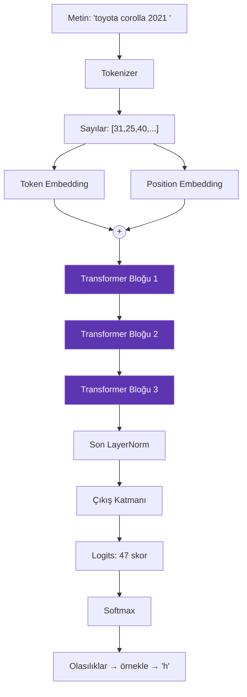

# Mimari Genel Bakış

Bu sayfa bir karakterin modele girip tahmine dönüşene kadarki yolculuğunu uçtan uca gösterir.

---

## Kuşbakışı



---

## Boyutların yolculuğu

Batch = 8 dizi, her dizi 64 karakter, `d_model` = 96, sözlük = 47.

| Aşama | Boyut | Açıklama |
|---|---|---|
| Ham token id'leri | `[8][64]` | 8 dizi × 64 karakter |
| Düzleştirme | `[512]` | Tek listeye serilir |
| Embedding sonrası | `[512 × 96]` | Her karakter 96 sayı |
| Blok içi Q, K, V | `[512 × 96]` | Üç ayrı projeksiyon |
| Tek kafa dilimi | `[64 × 24]` | Dizi başına, kafa başına |
| Attention skorları | `[64 × 64]` | Her karakter çifti |
| Blok çıkışı | `[512 × 96]` | Giriş ile aynı boyut |
| Çıkış katmanı sonrası | `[512 × 47]` | Her karakter için 47 skor |
| Loss | `[1 × 1]` | Tek sayı |

!!! tip "Kritik gözlem"
    Transformer bloğunun girişi ve çıkışı **aynı boyuttadır** (`[512 × 96]`). Bu yüzden blokları istediğiniz kadar üst üste koyabilirsiniz. `Layers = 3` yerine `Layers = 12` yazmak yeterlidir.

---

## Neden batch'ler tek matriste?

Naif yaklaşım: 8 diziyi tek tek işlemek.

```csharp
for (int b = 0; b < 8; b++) {
    var loss = model.Loss(inputs[b], targets[b]);
    loss.Backward();
}
```

Bu doğru çalışır ama yavaştır. 8 küçük matris çarpımı yerine **1 büyük** çarpım yapmak çok daha verimlidir (önbellek kullanımı ve paralelleştirme açısından).

Bu yüzden 8 dizi alt alta yığılır:

```text
satır   0- 63 → 1. dizi
satır  64-127 → 2. dizi
...
satır 448-511 → 8. dizi
```

Lineer katmanlar, LayerNorm, GELU — hepsi **satır bazlı** çalıştığı için bu yığından etkilenmez.

!!! danger "Ama attention farklı!"
    Attention satırlar **arasında** bilgi taşır. Eğer 512 satırın hepsine birden uygularsak, 3. dizinin karakterleri 1. dizinin karakterlerini görür — bu tamamen yanlış olur.

    Bu yüzden attention hesabı dizi dizi ayrılır. Ayrıntı: [Attention](attention.md).

---

## Katmanların görev dağılımı

| Bileşen | Görevi | Parametre payı |
|---|---|---|
| Token embedding | Karakter → vektör | %1,3 |
| Position embedding | Pozisyon → vektör | %1,8 |
| Attention (Q,K,V,proj) | Bilgiyi **taşır** | %31,5 |
| Feed-forward | Bilgiyi **işler** | %63,0 |
| LayerNorm | Sayıları **dengeler** | %0,4 |
| Çıkış katmanı | Vektör → skor | %1,3 |
| Çıkış bias | — | %0,01 |

!!! quote "Attention taşır, FFN düşünür"
    Attention'ın işi bilgiyi doğru yere götürmektir. Asıl "hesaplama" ve bilgi depolama feed-forward katmanında olur — parametrelerin üçte ikisi oradadır.

---

## Kod akışı

Tek bir `Forward` çağrısının izlediği yol:

```csharp
// src/GptModel.cs
public Tensor Forward(int[][] sequences)
{
    // 1. Token ve pozisyon id'lerini düzleştir
    var tokens = new int[batch * seqLen];
    var positions = new int[batch * seqLen];
    ...

    // 2. İki embedding'i topla
    var x = Ops.Add(
        Ops.Gather(_tokenEmbedding, tokens),
        Ops.Gather(_positionEmbedding, positions));

    // 3. Blokları sırayla uygula
    foreach (var block in _blocks)
        x = block.Forward(x, batch, seqLen);

    // 4. Normalize et ve skorlara çevir
    return _head.Forward(_finalNorm.Forward(x));
}
```

Her satır bir sonraki sayfalarda ayrıntılı açıklanıyor.

---

## Sayısal örnek: tek bir karakterin izi

`"benzi"` girdisinin ardından `n` tahmin edilirken neler oluyor?

1. **Tokenize**: `b`→14, `e`→17, `n`→26, `z`→38, `i`→21
2. **Embedding**: 21 numaralı satır tablodan çekilir → 96 sayı
3. **Pozisyon eklenir**: 5. pozisyonun vektörü toplanır
4. **Blok 1 attention**: `i` karakteri kendinden öncekilere bakar, `benz` dizisine yüksek ağırlık verir
5. **Blok 1 FFN**: "bu bir yakıt türü kalıbı" bilgisi vektöre işlenir
6. **Blok 2, 3**: Desen keskinleşir
7. **Çıkış katmanı**: 96 sayı → 47 skor
8. **Softmax**: `n` karakterine 0.94 olasılık
9. **Örnekleme**: `n` seçilir

---

## Sıradaki sayfalar

<div class="grid cards" markdown>

-   [__Tokenizer__](tokenizer.md)

    Metin nasıl sayıya dönüşüyor

-   [__Embedding__](embedding.md)

    Sayı nasıl anlamlı vektöre dönüşüyor

-   [__Attention__](attention.md)

    Karakterler birbirine nasıl bakıyor

-   [__Transformer Bloğu__](blok.md)

    Parçalar nasıl birleşiyor

-   [__Model__](model.md)

    Tamamı bir arada

</div>
