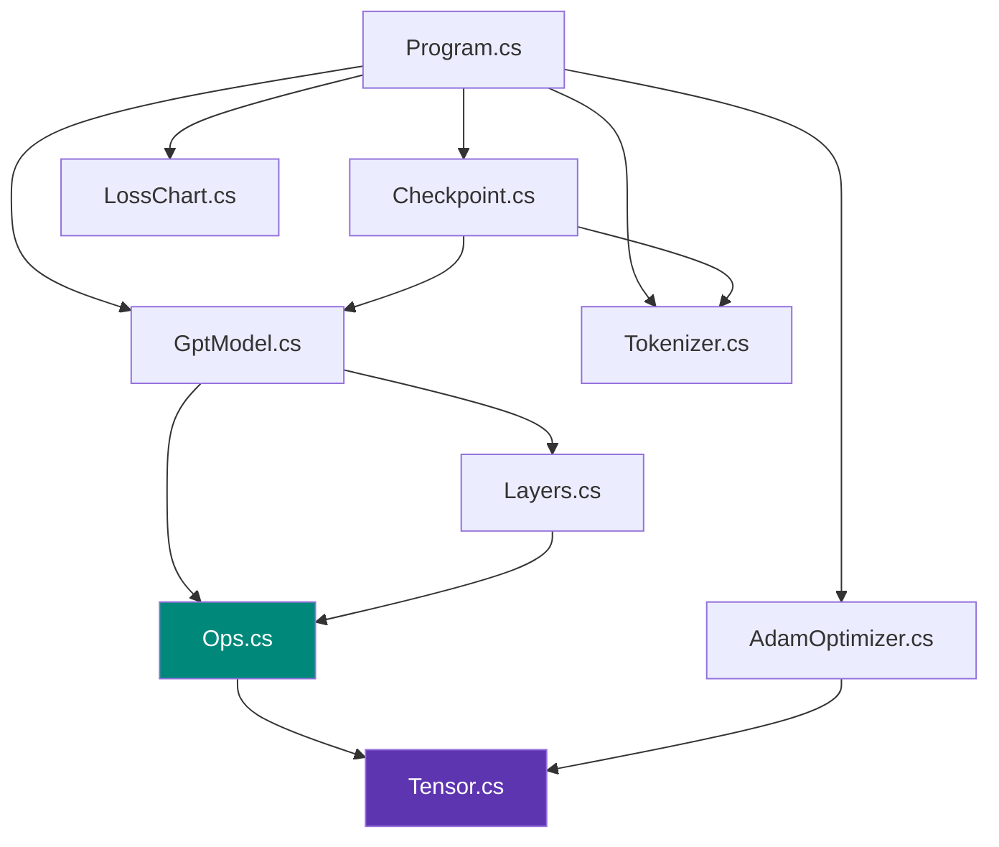

# Kod Haritası

Projedeki her dosyanın görevi, içeriği ve bağımlılıkları.

---

## Dosya listesi

| Dosya | Satır | Görev |
|---|---|---|
| `MiniTransformer.csproj` | 15 | Proje tanımı, .NET 10 hedefi |
| `Program.cs` | ~200 | Giriş noktası, CLI, eğitim döngüsü |
| `data/input.txt` | ~170 | Eğitim verisi (araç bilgileri) |
| `src/Tensor.cs` | ~75 | Matris + autograd düğümü |
| `src/Ops.cs` | ~560 | Türevlenebilir işlemler |
| `src/Layers.cs` | ~160 | Linear, LayerNorm, Attention, FFN, Blok |
| `src/GptModel.cs` | ~180 | Modelin tamamı + üretim |
| `src/AdamOptimizer.cs` | ~95 | Ağırlık güncelleme |
| `src/Tokenizer.cs` | ~30 | Metin ↔ sayı |
| `src/Checkpoint.cs` | ~200 | Kaydet/yükle (ikili + metin) |
| `src/LossChart.cs` | ~70 | ASCII grafik |

---

## Bağımlılık grafiği



`Tensor.cs` en alttaki temel; her şey ona dayanır.

---

## `src/Tensor.cs`

Autograd grafiğinin düğümü.

```csharp
public sealed class Tensor
{
    public readonly int Rows, Cols;
    public readonly float[] Data;     // değerler
    public readonly float[] Grad;     // gradyanlar
    internal Tensor[] Parents;        // hangi tensörlerden üretildi
    internal Action? BackwardFn;      // gradyanı nasıl dağıtacak

    public void ZeroGrad();
    public void Backward();           // topolojik sıra + ters gezinti
}
```

| Üye | Görev |
|---|---|
| `Data` | Değerler, satır-öncelikli düz dizi |
| `Grad` | `∂L/∂Data`, aynı boyut |
| `Parents` | Grafik kenarları |
| `BackwardFn` | Zincir kuralının bu düğümdeki adımı |
| `TopoOrder` | Yinelemeli DFS ile post-order sıralama |

📖 Ayrıntı: [Autograd](../egitim/autograd.md)

---

## `src/Ops.cs`

Tüm türevlenebilir işlemler. Her biri ileri geçişi hesaplar ve geri geçişi kapanış olarak saklar.

### SIMD yardımcıları

| Metot | İş |
|---|---|
| `Axpy(dst, src, scalar, n)` | `dst += src * scalar`, vektörize |
| `Dot(x, y, n)` | Nokta çarpımı, vektörize |

### İşlemler

| İşlem | Girdi → Çıktı | Türev |
|---|---|---|
| `MatMul(a,b)` | `[m×k],[k×n] → [m×n]` | `dA = dC·Bᵀ`, `dB = Aᵀ·dC` |
| `Add(a,b)` | Aynı boyut | Gradyanı kopyala |
| `AddRow(x,row)` | `[m×n],[1×n]` | `row` gradyanı sütun toplamı |
| `Scale(x,f)` | Skaler çarpım | `f` ile çarp |
| `Transpose(x)` | `[m×n] → [n×m]` | Transpoze |
| `Slice(x,r0,rn,c0,cn)` | Blok kesme | Yerine geri ekle |
| `ConcatCols(parts)` | Yatay birleştirme | Sütunlara dağıt |
| `ConcatRows(parts)` | Dikey birleştirme | Satırlara dağıt |
| `CausalMask(s)` | Üst üçgeni `-1e9` | Maskeliyi sıfırla |
| `SoftmaxRows(x)` | Satır bazlı softmax | `y(dy - Σdy·y)` |
| `Gelu(x)` | Aktivasyon | Tanh yaklaşımının türevi |
| `LayerNorm(x,g,b)` | Satır normalizasyonu | Üç terimli formül |
| `Gather(table,ids)` | Satır çekme | Dağıtarak topla |
| `CrossEntropy(logits,t)` | `[n×v] → [1×1]` | `p - y` |

📖 Ayrıntı: [Matematik](../temeller/matematik.md), [Loss](../egitim/loss.md)

---

## `src/Layers.cs`

Parametreli yapı taşları. Hepsi `IModule` arayüzünü uygular:

```csharp
public interface IModule
{
    IEnumerable<Tensor> Parameters();
}
```

| Sınıf | Parametreler | Forward |
|---|---|---|
| `Linear` | `Weight [in×out]`, `Bias [1×out]` | `AddRow(MatMul(x,W), b)` |
| `LayerNorm` | `Gain [1×n]`, `Bias [1×n]` | `Ops.LayerNorm` |
| `MultiHeadSelfAttention` | 4 × `Linear` (Q,K,V,proj) | Dizi ve kafa bazında dilimleme |
| `FeedForward` | 2 × `Linear` (96→384→96) | `down(GELU(up(x)))` |
| `TransformerBlock` | 2 LayerNorm + Attn + FFN | İki residual blok |

Ayrıca `Linear.NextGaussian` — Box-Muller ile normal dağılımlı rastgele sayı.

📖 Ayrıntı: [Attention](../mimari/attention.md), [Blok](../mimari/blok.md)

---

## `src/GptModel.cs`

```csharp
public sealed record GptConfig(int VocabSize, int BlockSize, int EmbedSize, int Heads, int Layers);

public sealed class GptModel : IModule
{
    public Tensor Forward(int[][] sequences);
    public Tensor Loss(int[][] inputs, int[][] targets);
    public IEnumerable<Tensor> Parameters();
    public string Generate(Tokenizer t, string prompt, int max, double temp, int topK, Random rng);
}
```

| Alan | Boyut |
|---|---|
| `_tokenEmbedding` | `[47 × 96]` |
| `_positionEmbedding` | `[64 × 96]` |
| `_blocks` | 3 × `TransformerBlock` |
| `_finalNorm` | `LayerNorm[96]` |
| `_head` | `Linear[96 → 47]` |

`SampleLastRow` — temperature + top-k + roulette wheel örnekleme.

📖 Ayrıntı: [Model](../mimari/model.md), [Üretim](../kullanim/uretim.md)

---

## `src/AdamOptimizer.cs`

```csharp
public sealed class AdamOptimizer
{
    public double LearningRate { get; set; }
    public void ZeroGrad();
    public void ClipGradients(double maxNorm);
    public void Step();
}
```

| Durum | Tip | Neden |
|---|---|---|
| `_m` | `double[][]` | Birinci moment, hassasiyet için `double` |
| `_v` | `double[][]` | İkinci moment |
| `_step` | `int` | Bias düzeltmesi için |

📖 Ayrıntı: [Optimizer](../egitim/optimizer.md)

---

## `src/Tokenizer.cs`

```csharp
public sealed class Tokenizer
{
    public Tokenizer(string corpus);      // sözlüğü metinden kurar
    public int VocabSize { get; }
    public string Vocabulary { get; }     // checkpoint için
    public int[] Encode(string text);
    public string Decode(IEnumerable<int> ids);
}
```

📖 Ayrıntı: [Tokenizer](../mimari/tokenizer.md)

---

## `src/Checkpoint.cs`

```csharp
public static class Checkpoint
{
    public static void Save(string path, GptModel model, Tokenizer tokenizer);
    public static (GptModel, Tokenizer) Load(string path);
}
```

Uzantıya göre ikili (`SaveBinary`/`LoadBinary`) veya metin (`SaveText`/`LoadText`) formatı seçer.

Yardımcılar: `BuildTarget` (model kurma + sayı doğrulama), `ExpectShape` (boyut doğrulama), `NextTokens` (metin ayrıştırma).

📖 Ayrıntı: [Checkpoint](../kullanim/checkpoint.md)

---

## `src/LossChart.cs`

```csharp
public static class LossChart
{
    public static string Render(IReadOnlyList<double> values, int width = 76, int height = 18);
}
```

Değerleri sütunlara ortalayarak sığdırır, dikey konuma eşler, eksen etiketleriyle birlikte string döner.

📖 Ayrıntı: [Loss Eğrisi](../kullanim/loss-egrisi.md)

---

## `Program.cs`

```csharp
public static int Main(string[] args)     // komut yönlendirme
private static void Train(string path)    // eğitim döngüsü
private static void GenerateFrom(...)     // checkpoint yükle + üret
private static void ShowLoss(string csv)  // CSV oku + çiz
private static void PrintLossSummary(...) // ilk/en iyi/son 50
private static double CosineSchedule(int) // warmup + kosinüs
private static (int[][], int[][]) SampleBatch(...)
private static string SaveLossCsv(...)
private static string LoadCorpus()
```

Hiperparametreler dosyanın başındaki `const` alanlarda.

📖 Ayrıntı: [CLI](../baslangic/cli.md), [Eğitim Döngüsü](../egitim/dongu.md)

---

## Okuma sırası önerisi

Kodu ilk kez inceliyorsanız:

1. **`Tokenizer.cs`** — en basit, 30 satır
2. **`Tensor.cs`** — veri yapısını anlayın
3. **`Ops.cs` → `Add`** — en basit işlem, ileri+geri şablonunu görün
4. **`Ops.cs` → `MatMul`** — asıl iş burada
5. **`Layers.cs` → `Linear`** — ilk parametreli katman
6. **`Layers.cs` → `MultiHeadSelfAttention`** — kalbi
7. **`GptModel.cs` → `Forward`** — hepsi bir arada
8. **`Ops.cs` → `CrossEntropy`** — loss ve zarif türevi
9. **`Tensor.cs` → `Backward`** — sihrin gerçekleştiği yer
10. **`AdamOptimizer.cs`** — güncelleme
11. **`Program.cs` → `Train`** — döngü

---

## Kod istatistikleri

| Ölçü | Değer |
|---|---|
| Toplam satır | ~1.500 |
| Sınıf sayısı | 11 |
| NuGet bağımlılığı | **0** |
| Türevlenebilir işlem | 14 |
| Parametre tensörü | 54 |
| Öğrenilebilir parametre | 350.927 |
