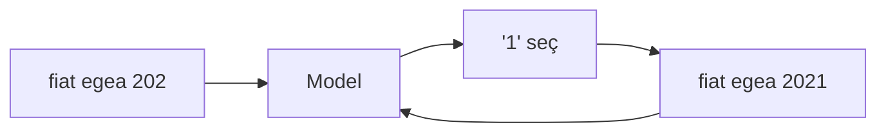

# Dil Modeli Nedir?

## Tanım

Bir dil modeli, verilen metnin ardından **hangi parçanın gelme olasılığının ne olduğunu** söyleyen bir fonksiyondur.

$$P(\text{sonraki} \mid \text{şu ana kadarki metin})$$

Örneğin `"renault clio 2021 benz"` girdisi için model şöyle bir dağılım üretir:

| Karakter | Olasılık |
|---|---|
| `i` | 0.94 |
| `e` | 0.03 |
| `a` | 0.01 |
| diğer 44 karakter | 0.02 |

Model `i` der. Sonra `"...benzi"` ile tekrar sorar, `n` gelir. Böyle böyle `"benzin"` oluşur.

---

## Otoregresif üretim

"Otoregresif" korkutucu bir kelime ama anlamı basit: **kendi çıktısını tekrar girdi olarak kullanmak.**



Kod olarak ([GptModel.cs](../mimari/model.md)):

```csharp
for (int step = 0; step < maxNewTokens; step++)
{
    var window = context.Skip(Math.Max(0, context.Count - _config.BlockSize)).ToArray();
    var logits = Forward([window]);
    int next = SampleLastRow(logits, temperature, topK, rng);
    context.Add(next);   // (1)!
}
```

1. Yeni karakter bağlama eklenir ve döngü tekrar başlar.

!!! quote "Şaşırtıcı gerçek"
    ChatGPT de dahil tüm büyük dil modelleri **tam olarak bunu** yapar. Plan yapmazlar, cümlenin sonunu bilmezler. Sadece bir sonraki tokeni seçerler. Uzun ve tutarlı metinler bu basit kuralın tekrarından doğar.

---

## Token nedir?

Model harflerle çalışamaz, sayılarla çalışır. Metni sayılara bölme işine **tokenizasyon**, parçalara **token** denir.

Üç yaklaşım var:

=== "Karakter seviyesi (bu proje)"

    ```text
    "fiat egea" → ['f','i','a','t',' ','e','g','e','a']
                → [17, 20, 12, 31, 1, 16, 18, 16, 12]
    ```

    | Artı | Eksi |
    |---|---|
    | Çok küçük sözlük (47) | Uzun diziler |
    | Bilinmeyen karakter sorunu yok | Model önce yazmayı öğrenmeli |
    | Anlaşılması kolay | Bağlam penceresi çabuk dolar |

=== "Kelime seviyesi"

    ```text
    "fiat egea" → ["fiat", "egea"] → [4521, 8832]
    ```

    | Artı | Eksi |
    |---|---|
    | Kısa diziler | Devasa sözlük (100binler) |
    | Anlamlı birimler | Bilinmeyen kelime sorunu |
    | | Türkçe'de ek patlaması: "ev, evde, evimde..." |

=== "Alt-kelime / BPE (modern standart)"

    ```text
    "fiat egea" → ["fi", "at", " eg", "ea"] → [512, 315, 2201, 890]
    ```

    En sık geçen karakter çiftleri birleştirilerek sözlük oluşturulur. GPT ailesi bunu kullanır. Denge noktası: ~50.000 token, hem kısa diziler hem bilinmeyen kelime sorunu yok.

Bu projede karakter seviyesi seçildi çünkü **anlaşılması en kolay olanı** ve `Tokenizer` sınıfı 20 satırda bitiyor:

```csharp
// src/Tokenizer.cs
_idToChar = corpus.Distinct().OrderBy(c => c).ToArray();
_charToId = _idToChar.Select((c, i) => (c, i)).ToDictionary(t => t.c, t => t.i);
```

---

## Bağlam penceresi (context window)

Model sınırsız geçmişe bakamaz. Bu projede sınır **64 karakter**:

```csharp
private const int BlockSize = 64;
```

Bunun anlamı: 65. karakteri tahmin ederken 1. karakter tamamen unutulmuştur. Model için hiç var olmamıştır.

| Model | Bağlam penceresi |
|---|---|
| MiniTransformer | 64 karakter (~10 kelime) |
| GPT-2 | 1.024 token (~750 kelime) |
| GPT-4 Turbo | 128.000 token (~96.000 kelime) |
| Gemini 1.5 Pro | 1.000.000 token (~750.000 kelime) |

!!! danger "Neden sınırsız olamıyor?"
    Attention mekanizması her token çiftini karşılaştırır. $n$ token için $n^2$ işlem gerekir. 64 token → 4.096 karşılaştırma. 1 milyon token → 1 trilyon karşılaştırma. Bu yüzden uzun bağlam çok pahalıdır.

---

## Model ne "bilir"?

Eğitim bittikten sonra model **hiçbir metne erişmez**. Elindeki tek şey 350.927 sayı.

Bu sayılarda ne kodlanmış olabilir?

- Hangi karakter hangisinden sonra gelir
- Marka isimlerinin yazılışı
- Satırların yapısı (yıl 4 haneli, güç "hp" ile biter)
- "elektrik" gördüyse "otomatik" gelme eğilimi

Neler kodlanmamış:

- Bir arabanın ne olduğu
- 1750bin TL'nin çok mu az mı olduğu
- 2023'ün 2020'den sonra geldiği

!!! example "Bunu test edin"
    ```powershell
    dotnet run -c Release -- generate "togg t10x 1850 "
    ```
    Model 1850 yılını garipsemez, çünkü "yıl" diye bir kavramı yok. Sadece "4 rakam sonra boşluk sonra yakıt türü" desenini bilir.

---

## Loss ve "şaşkınlık"

Dil modellerinin kalitesi **cross-entropy loss** ile ölçülür. Anlamı: *"Model doğru cevabı ne kadar beklemiyordu?"*

$$L = -\log P(\text{doğru karakter})$$

| Durum | Olasılık | Loss |
|---|---|---|
| Kesin biliyor | 0.99 | 0.01 |
| İyi tahmin | 0.70 | 0.36 |
| Kararsız | 0.30 | 1.20 |
| Rastgele (47 seçenek) | 0.021 | **3.85** |
| Tamamen yanılmış | 0.001 | 6.91 |

Bizim modelimiz 3.87'den 0.26'ya indi. Yani ortalama olarak doğru karaktere **%77 olasılık** veriyor.

İlgili bir kavram **perplexity** (şaşkınlık): $e^{L}$. Loss 0.26 → perplexity 1.30. Yorumu: "Model sanki her adımda 1,3 seçenek arasında kalıyor." Rastgele bir modelin perplexity'si 47 olurdu.

---

Sıradaki adım: [Gerekli Matematik](matematik.md)
