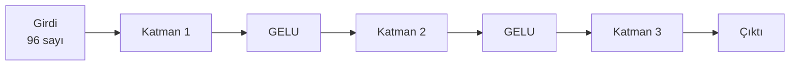
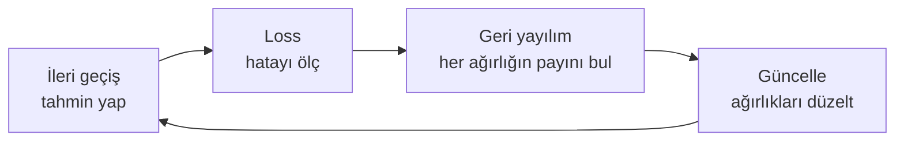

# Sinir Ağı Nedir?

## En küçük parça: nöron

Bir yapay nöron üç şey yapar:

1. Gelen sayıları ağırlıklarla çarpar
2. Hepsini toplar
3. Sonucu bir fonksiyondan geçirir

$$y = f(w_1 x_1 + w_2 x_2 + \dots + w_n x_n + b)$$

- $x_i$ — girdiler
- $w_i$ — **ağırlıklar** (öğrenilen sayılar)
- $b$ — **bias** (kaydırma, o da öğrenilir)
- $f$ — **aktivasyon fonksiyonu**

Somut örnek: Bir evin fiyatını tahmin eden nöron.

```text
x1 = 120 (metrekare),  w1 = 15.000
x2 = 3   (oda sayısı), w2 = 50.000
b  = 200.000

y = 120×15.000 + 3×50.000 + 200.000 = 2.150.000
```

Bu kadar. Nöron dediğimiz şey, ağırlıklı toplamdan ibaret.

---

## Katman: yan yana duran nöronlar

Tek nöron tek sayı üretir. 96 nöronu yan yana koyarsak 96 sayı üretiriz. Buna **katman** denir.

Ve işte güzel kısım: 96 nöronun her birinin ağırlıklı toplamını ayrı ayrı hesaplamak yerine, hepsini tek bir **matris çarpımı** ile yaparız.

```csharp
// src/Layers.cs — Linear katmanı
public Tensor Forward(Tensor x) => Ops.AddRow(Ops.MatMul(x, Weight), Bias);
```

`MatMul` = matris çarpımı, `AddRow` = bias ekleme. Bir satırda 96 nöron.

!!! info "Matris çarpımı hatırlatması"
    $[m \times k]$ boyutlu bir matrisi $[k \times n]$ ile çarparsanız $[m \times n]$ elde edersiniz.

    Bizde: $[64 \text{ karakter} \times 96 \text{ boyut}] \times [96 \times 96] = [64 \times 96]$

    Yani 64 karakterin her biri için 96 nöron aynı anda hesaplanır.

---

## Aktivasyon: doğrusallığı kırmak

Neden $f$ fonksiyonuna ihtiyaç var? Çünkü **onsuz derinlik anlamsızdır**.

İki katmanı üst üste koyalım, aktivasyon olmadan:

$$y = W_2(W_1 x) = (W_2 W_1) x = W_3 x$$

İki matrisin çarpımı yine bir matristir! Yani 100 katmanlı ağınız matematiksel olarak tek katmana eşittir. Aktivasyon fonksiyonu bu çöküşü engeller.

Bu projede **GELU** kullanılıyor:

$$\text{GELU}(x) = 0.5x\left(1 + \tanh\left(\sqrt{\tfrac{2}{\pi}}(x + 0.044715x^3)\right)\right)$$

```csharp
// src/Ops.cs
float t = MathF.Tanh(C * (v + (0.044715f * v * v * v)));
outTensor.Data[i] = 0.5f * v * (1.0f + t);
```

Görsel olarak: negatif sayıları yumuşakça sıfıra bastırır, pozitifleri neredeyse aynen geçirir.

| Girdi | GELU çıktısı |
|---|---|
| -3.0 | -0.004 |
| -1.0 | -0.159 |
| 0.0 | 0.000 |
| 1.0 | 0.841 |
| 3.0 | 2.996 |

ReLU'dan (`max(0,x)`) farkı: keskin köşesi yok, türevi her yerde düzgün. Bu da eğitimi kolaylaştırır.

---

## Derin ağ: katmanların üst üste gelmesi



Her katman bir önceki katmanın çıktısını girdi olarak alır. Derinliğin faydası **soyutlama**dır:

| Katman | Ne yakalar (karakter modelinde) |
|---|---|
| 1 | Hangi harften sonra hangi harf gelir |
| 2 | Hece ve kelime sınırları |
| 3 | Satır formatı, alan sırası |

Görüntü modellerinde de aynı: kenar → şekil → nesne.

---

## Peki ağırlıklar nasıl bulunuyor?

Üç adımlı döngü:



### 1. İleri geçiş (forward pass)

Girdi katmanlardan geçer, bir tahmin çıkar.

### 2. Loss (kayıp)

Tahmin ile gerçek arasındaki fark ölçülür. Tek bir sayı. Bkz. [Loss Fonksiyonu](../egitim/loss.md).

### 3. Geri yayılım (backpropagation)

İşin kalbi burası. Soru şu: **"Bu 350.927 ağırlığın her biri hatadan ne kadar sorumlu?"**

Cevap zincir kuralı ile bulunur. Lise türevinden hatırlayın:

$$\frac{dy}{dx} = \frac{dy}{du} \cdot \frac{du}{dx}$$

Ağın sonundan başlayıp geriye doğru her katmanda türevi çarparak ilerlersiniz. Sonuçta her ağırlık için bir **gradyan** (eğim) elde edersiniz: "bu ağırlığı 1 birim artırırsam loss ne kadar değişir?"

Bu projede o mekanizma [Tensor.cs](../egitim/autograd.md) dosyasında yazılıdır.

### 4. Güncelleme

Gradyan "yokuş yukarı"yı gösterir. Biz loss'u azaltmak istediğimiz için **ters yöne** küçük bir adım atarız:

$$w_{\text{yeni}} = w_{\text{eski}} - \eta \cdot \frac{\partial L}{\partial w}$$

$\eta$ (eta) **öğrenme oranı**dır. Ne kadar büyük adım atılacağını belirler.

---

## Gradyan inişi: vadi benzetmesi

Sisli bir dağda olduğunuzu düşünün. En alçak noktaya inmek istiyorsunuz ama 2 metreden ötesini göremiyorsunuz.

Yapacağınız şey: ayağınızın altındaki eğime bakıp en dik iniş yönünde bir adım atmak. Sonra tekrar bakmak. Tekrar adım atmak.

Bu **gradyan inişi**dir. Tek fark: bizim dağımız 350.927 boyutlu bir uzayda.

!!! warning "Adım boyu kritiktir"
    - **Çok büyük adım**: vadiyi atlayıp karşı yamaca çıkarsınız, loss patlar
    - **Çok küçük adım**: bir ömür sürer
    - **Doğru adım**: hızlı ve kararlı iniş

    Bu yüzden [learning rate](../egitim/optimizer.md) en kritik ayardır.

---

## Bu projede sinir ağı nerede?

| Kavram | Dosya | Kod |
|---|---|---|
| Nöron katmanı | `src/Layers.cs` | `Linear` sınıfı |
| Aktivasyon | `src/Ops.cs` | `Gelu` |
| İleri geçiş | `src/GptModel.cs` | `Forward` |
| Loss | `src/Ops.cs` | `CrossEntropy` |
| Geri yayılım | `src/Tensor.cs` | `Backward` |
| Güncelleme | `src/AdamOptimizer.cs` | `Step` |

---

Sıradaki adım: [Dil Modeli Nedir?](dil-modeli.md)
