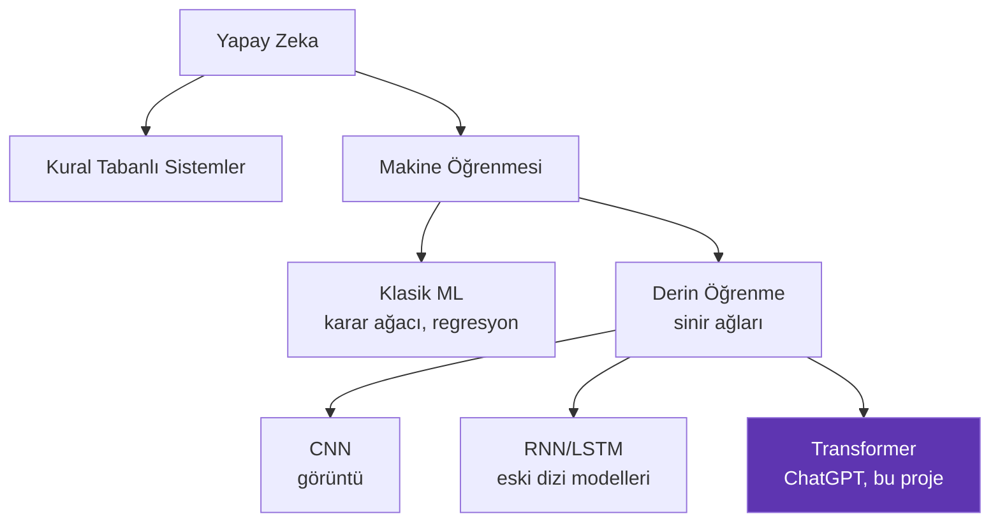
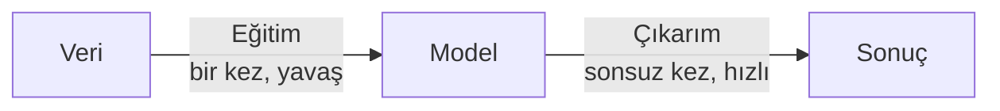

# Yapay Zeka Nedir?

Bu sayfa hiçbir teknik bilgi varsaymaz. Yapay zekanın ne olduğunu ve **ne olmadığını** anlatır.

---

## Klasik programlama vs. makine öğrenmesi

### Klasik programlama: kuralları siz yazarsınız

Bir e-postanın spam olup olmadığını anlamak isteyelim:

```csharp
bool SpamMi(string mesaj)
{
    if (mesaj.Contains("bedava")) return true;
    if (mesaj.Contains("kazandınız")) return true;
    if (mesaj.Contains("tıklayın")) return true;
    return false;
}
```

Burada **siz** düşünüp kuralları yazdınız. Program sadece uyguluyor.

Sorun: Gerçek hayatta kurallar binlerce ve istisnalarla dolu. "Bedava kargo" spam değil. Hiç kimse bütün durumları elle yazamaz.

### Makine öğrenmesi: kuralları veri belirler

```text
Girdi: 100.000 e-posta + her birinin spam olup olmadığı
Çıktı: Kuralları kendisi bulan bir program
```

Siz kural yazmıyorsunuz. **Örnek** veriyorsunuz. Program örneklerden deseni çıkarıyor.

!!! abstract "Temel fark"
    **Klasik programlama:** kurallar + veri → cevap
    **Makine öğrenmesi:** veri + cevap → kurallar

---

## Peki "öğrenmek" ne demek?

Şaşırtıcı derecede basit: **sayıları ayarlamak.**

Bir örnekle görelim. Diyelim ki ev fiyatı tahmin etmek istiyoruz ve elimizde tek bir bilgi var: evin metrekaresi.

$$\text{fiyat} = a \times \text{metrekare} + b$$

Burada $a$ ve $b$ bilinmiyor. Bunlara **parametre** (veya ağırlık) denir. "Öğrenmek", doğru $a$ ve $b$ değerlerini bulmaktır.

Nasıl buluruz?

1. $a$ ve $b$ için rastgele değerler seç (diyelim $a=1$, $b=0$)
2. Bir evi tahmin et: 100 m² → 100 TL
3. Gerçek fiyata bak: 2.000.000 TL
4. **Hata**: çok düşük tahmin ettik
5. $a$'yı biraz büyüt
6. 1-5 arasını on binlerce kez tekrarla

Sonunda $a \approx 20.000$ gibi bir değere oturur. İşte bu öğrenmedir.

MiniTransformer'da farklı olan tek şey: 2 parametre yerine **350.927 parametre** var ve "fiyat" yerine "bir sonraki karakter" tahmin ediliyor.

---

## Yapay zeka türleri



Bu projenin yeri: **Yapay Zeka → Makine Öğrenmesi → Derin Öğrenme → Transformer**.

---

## "Üretken yapay zeka" (Generative AI) nedir?

İki tür model vardır:

| Tür | Ne yapar | Örnek |
|---|---|---|
| **Ayırt edici** (discriminative) | Sınıflandırır, karar verir | "Bu e-posta spam mı?" |
| **Üretken** (generative) | Yeni içerik üretir | "Bana bir e-posta yaz" |

MiniTransformer üretkendir. Bir sonraki karakteri tahmin ederek metin **üretir**.

İlginç olan şu: aslında yaptığı iş de bir sınıflandırmadır! "47 karakterden hangisi gelecek?" sorusu 47 sınıflı bir sınıflandırma problemidir. Bunu tekrar tekrar yapınca üretim ortaya çıkar.

!!! quote "Önemli içgörü"
    Üretim = art arda yapılan tahminler. Sihir yok, sadece döngü var.

---

## Model, eğitim, çıkarım

Sürekli karşılaşacağınız üç terim:

**Model**: Parametrelerin (sayıların) tamamı + bunların nasıl kullanılacağını tarif eden yapı. Bizim durumumuzda 350.927 sayı ve transformer mimarisi.

**Eğitim (training)**: Parametreleri veriye bakarak ayarlama süreci. Yavaş ve pahalı. Bizde 2,5 dakika, GPT-4'te aylar ve milyonlarca dolar.

**Çıkarım (inference)**: Eğitilmiş modeli kullanma. Hızlı ve ucuz. Bizde 4 saniye.



---

## Yaygın yanlış anlamalar

!!! failure "Yanlış: Yapay zeka 'düşünür'"
    Hayır. Matris çarpımı yapar. Bir sonraki karakterin olasılık dağılımını hesaplar ve rastgele örnekler. "Anlama" dediğimiz şey, istatistiksel desenlerin çok karmaşık hale gelmiş halidir.

!!! failure "Yanlış: Model interneti arar"
    Hayır. Eğitim bittikten sonra model **hiçbir veriye erişmez**. Bildiği her şey o 350.927 sayının içinde kodlanmıştır. (ChatGPT'nin web araması ayrı bir özelliktir, modelin kendisi değil.)

!!! failure "Yanlış: Model verileri saklar"
    Hayır. Bizim eğitim verimiz 10 KB, modelimiz 1,37 MB. Ama model veriyi kopyalamaz — desenini öğrenir. Nitekim `hyundai itonic` gibi veride olmayan şeyler üretir.

!!! failure "Yanlış: Daha çok veri = her zaman daha iyi"
    Veri kalitesi miktarından önemlidir. Çelişkili veya rastgele veri modeli bozar. "Çöp girer, çöp çıkar."

---

Sıradaki adım: [Sinir Ağı Nedir?](sinir-agi.md)
